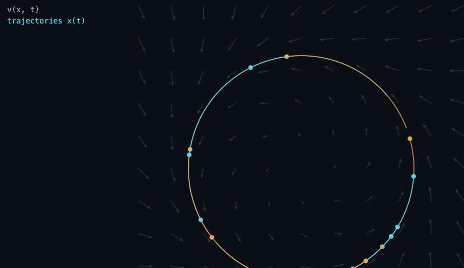
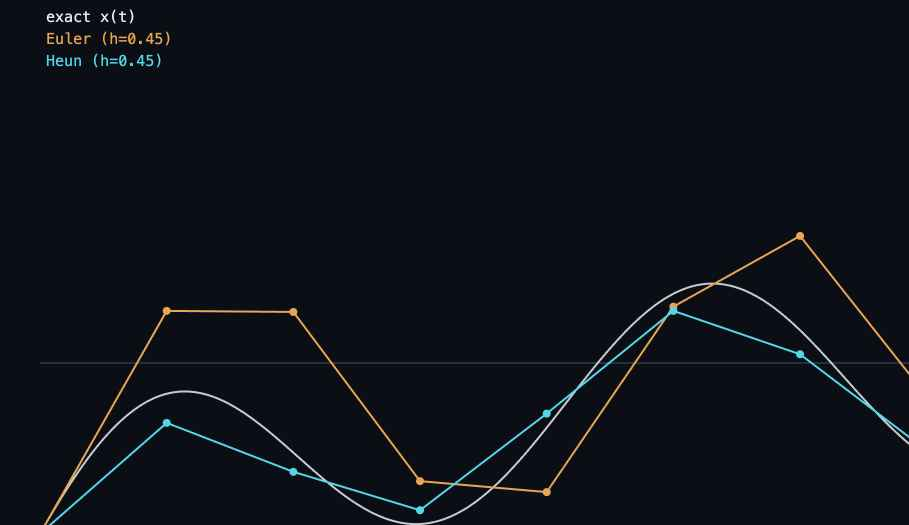
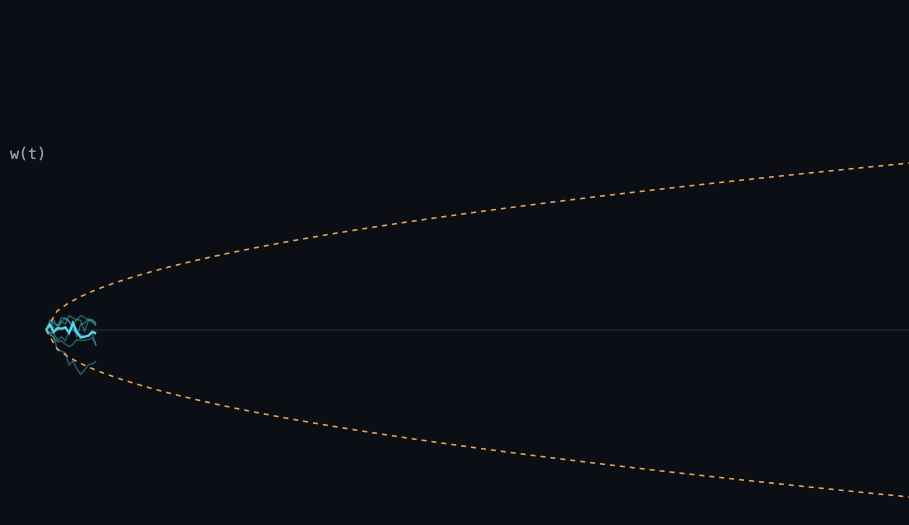
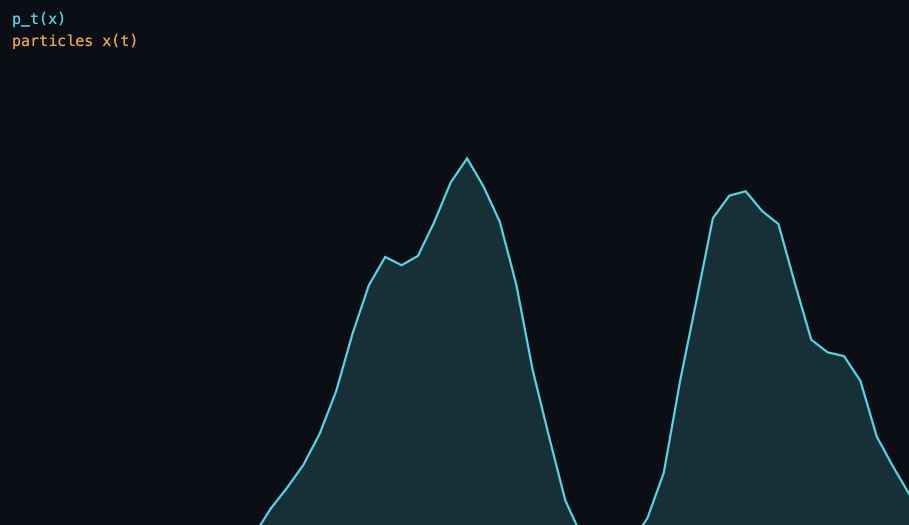
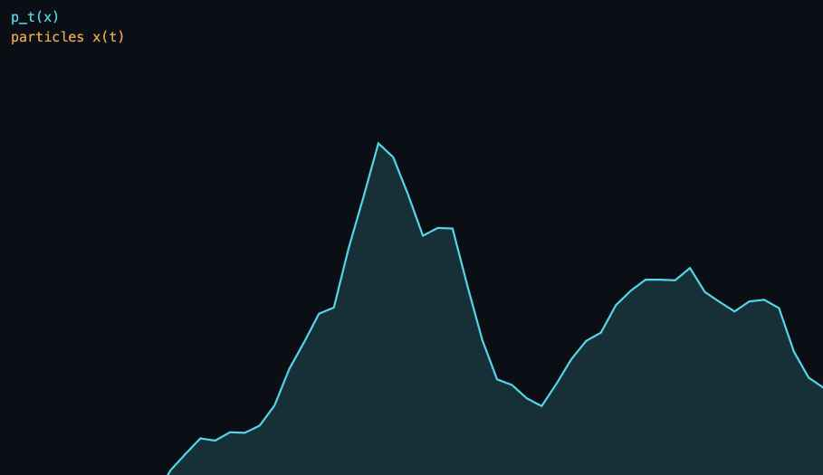
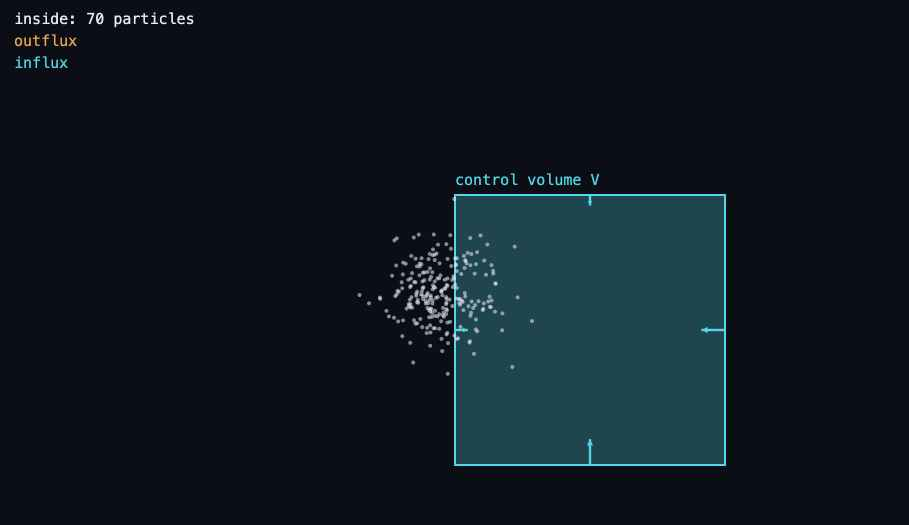
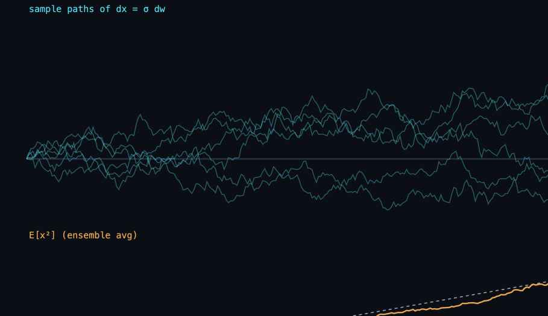
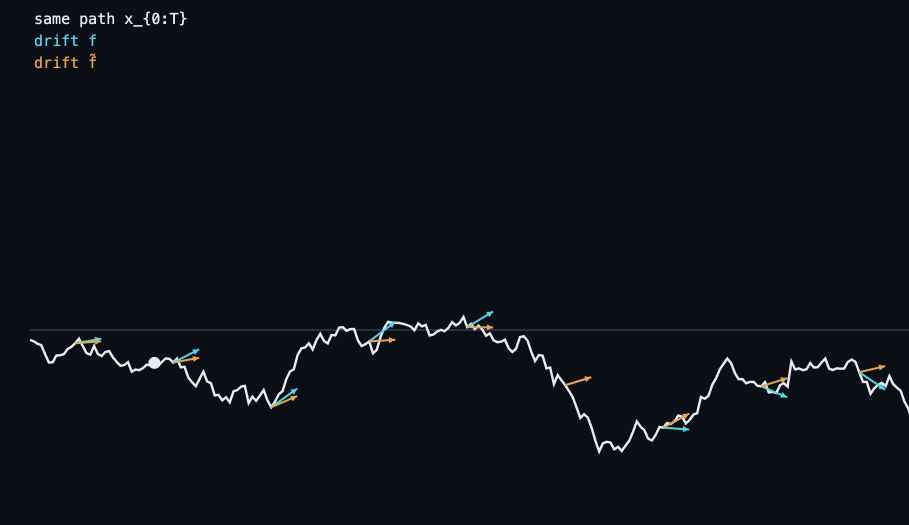

> 基于 *The Principles of Diffusion Models*(Lai · Song · Kim · Mitsufuji · Ermon,arXiv 2510.21890v2)附录 A(p.399)、B(p.414)、C(p.431)。
> 中文讲解 + 英文术语;公式为 LaTeX。插图为动画的静态快照。

---

## 附录地图

| 附录 | 主题 | 支撑正文 |
|---|---|---|
| **A** | 微分方程速成:ODE 存在唯一性、积分因子、数值求解器;SDE、Wiener 过程、Euler–Maruyama | PF-ODE 良定性(第4章)、快速采样器(第9章)、flow map 模型(第10–11章) |
| **B** | 密度演化:变量替换 → 连续性方程 → Fokker–Planck;选读 Wasserstein 梯度流 | Normalizing Flows(第5章)、Flow Matching、Score SDE 边缘匹配(第4章) |
| **C** | Itô 公式(随机链式法则)与 Girsanov 定理(路径测度换元) | Fokker–Planck 推导、反向 SDE、score matching 与似然(第4章) |

三者构成同一门语言:**样本层面用 ODE / SDE 说话,分布层面用 PDE 说话。**

---

# A · 微分方程速成

## A.0 三类微分方程

| 类型 | 描述什么 | 在扩散模型中的角色 |
|---|---|---|
| ODE | 状态按精确规则随时间演化;起点定,路径就定 | PF-ODE 采样、确定性生成轨迹 |
| SDE | 在演化中注入噪声,结果由确定变为概率 | 前向加噪、反向生成 SDE |
| PDE | 多变量函数(时间+空间)共同演化 | 密度演化 —— Fokker–Planck 方程 |

## A.1.1 ODE 的定义:向量场与轨迹

$$\frac{d\mathbf{x}(t)}{dt} = \mathbf{v}(\mathbf{x}(t),\, t) \tag{A.1.1}$$

- \(\mathbf{x}(t)\in\mathbb{R}^D\) 是系统状态,\(\mathbf{v}\) 是向量场:每个时空点上"该怎么动"的局部指令。
- 解 \(\mathbf{x}(t)\) 是一条曲线,每一瞬间的切线都与当地向量对齐。
- **一句话:解 ODE = 把一颗粒子放进流场,看它随时间去哪。**

<figure style="margin:1.2rem 0;">
<anim-ode-field style="display:block;width:100%;max-width:720px;margin:0 auto;height:500px;"></anim-ode-field>
<noscript></noscript>
<figcaption style="text-align:center;color:var(--secondary,#8B95A8);font-size:.9em;margin-top:.4rem;">向量场与轨迹:同一流场上的多条轨迹(极限环)</figcaption>
</figure>

不指定初值时,无穷多条轨迹与向量场相容;固定 \(\mathbf{x}(0)\) 后,路径唯一。

## A.1.2 存在唯一性

**问题(Question A.1.1)**:选定起点,顺着箭头走的路径存在吗?唯一吗?粒子会不会中途跳到另一条轨迹上?

**定理 A.1.1(Picard–Lindelöf,局部)**:若 \(\mathbf{v}\) 连续,且对 \(\mathbf{x}\) 满足 Lipschitz 条件

$$\|\mathbf{v}(\mathbf{x}_1,t)-\mathbf{v}(\mathbf{x}_2,t)\| \le L\,\|\mathbf{x}_1-\mathbf{x}_2\|$$

则对任意初值,解在 \([t_0-\delta, t_0+\delta]\) 上存在且唯一。
直觉:向量场对状态的敏感度有上限,箭头不会"变脸"太快。

**证明思路(Picard 迭代)**:

$$\mathbf{x}_{n+1}(t) = \mathbf{x}_0 + \int_{t_0}^{t} \mathbf{v}(\mathbf{x}_n(s),\,s)\, ds$$

1. 以常函数 \(\mathbf{x}_0(t)=\mathbf{x}_0\) 作初始猜测;
2. 反复代入积分形式得函数序列;
3. Lipschitz + 压缩映射定理 ⇒ 收敛到唯一解。

> 前向引用:同一不动点思想被 ParaDiGMs(正文 §9.7)用来并行加速扩散采样。

**全局版本(Carathéodory)**:把解延拓到整个 \([t_0,T]\) 需要两个条件:

1. 局部 Lipschitz:\(\|\mathbf{v}(\mathbf{x}_1,t)-\mathbf{v}(\mathbf{x}_2,t)\| \le \mathrm{Lip}(t)\|\mathbf{x}_1-\mathbf{x}_2\|\),\(\mathrm{Lip}(t)\) 可积即可;
2. 线性增长:\(\|\mathbf{v}(\mathbf{x},t)\| \le M(t)(1+\|\mathbf{x}\|)\) ⇒ 解不会有限时间爆炸。

> 与扩散模型的联系:把这两个条件加在 score \(\nabla_\mathbf{x}\log p_t\) 上,PF-ODE 才是良定的。

**推论(轨迹不相交)**:初值不同的两个解满足 \(\mathbf{x}_1(t)\neq\mathbf{x}_2(t)\;\forall t\)。
证明(反证):若在 \(t^*\) 相遇,取首次相遇时刻 \(t_0\),以相遇点为初值,由唯一性两解在 \([t_0,T]\) 重合;把唯一性反向用于 \([0,t_0]\),全程重合 —— 与初值不同矛盾。∎

> 这是 flow map 模型(Consistency Model、CTM、Mean Flow,正文第10–11章)能把"任意时刻 ↦ 任意时刻"学成单值映射的隐性支柱。

## A.1.3 指数积分因子与半线性 ODE

线性 ODE \(\frac{dx}{dt} = L(t)x\) 的闭式解:

$$x(t) = x(s)\cdot\exp\Big(\int_s^t L(\tau)\,d\tau\Big), \qquad E(s\!\rightsquigarrow\! t) := \exp\Big(\int_s^t L(\tau)\, d\tau\Big) \tag{A.1.2}$$

**半线性 ODE**:

$$\frac{d\mathbf{x}}{dt} = L(t)\,\mathbf{x} + \mathbf{N}(\mathbf{x},t) \tag{A.1.3}$$

三步推导:
1. 两边乘 \(E^{-1}(s\!\rightsquigarrow\!t)\),乘积法则合并:\(\frac{d}{dt}[E^{-1}\mathbf{x}] = E^{-1}\mathbf{N}\);
2. 从 s 积到 t;
3. 解出:

$$\mathbf{x}(t) = \underbrace{E(s\!\rightsquigarrow\! t)\,\mathbf{x}(s)}_{\text{线性:精确}} + \underbrace{\int_s^t E(\tau\!\rightsquigarrow\! t)\,\mathbf{N}(\mathbf{x}(\tau),\tau)\,d\tau}_{\text{非线性:待离散}} \tag{A.1.4}$$

> **为什么关键**:线性部分精确解掉、只离散非线性残差 ⇒ 步长由非线性动态决定。这是 DPM-Solver 系列(第9章)快的根源 —— PF-ODE 恰好是半线性的。

## A.1.4 数值求解

积分形式 \(\mathbf{x}(t) = \mathbf{x}(0) + \int_0^t \mathbf{v}\,d\tau\)(A.1.5)几乎无闭式解,于是离散化:网格 \(t_0,\dots,t_n\)、步长 \(\Delta t_i\)、用斜率采样组合逼近、控制误差。

| 求解器 | 更新 | 全局误差 |
|---|---|---|
| Euler(一阶) | \(\mathbf{x}_{n+1} = \mathbf{x}_n + h\,\mathbf{v}(\mathbf{x}_n,t_n)\) | \(O(h)\) |
| Heun(二阶,预测–校正) | \(\mathbf{x}_{n+1} = \mathbf{x}_n + \tfrac{h}{2}(\mathbf{v}(\mathbf{x}_n,t_n) + \mathbf{v}(\mathbf{x}_{\text{pred}},t_n\!+\!h))\) | \(O(h^2)\) |
| RK4(四阶) | \(\mathbf{x}_{n+1} = \mathbf{x}_n + \tfrac{h}{6}(k_1+2k_2+2k_3+k_4)\) | \(O(h^4)\) |

<figure style="margin:1.2rem 0;">
<anim-euler style="display:block;width:100%;max-width:720px;margin:0 auto;height:420px;"></anim-euler>
<noscript></noscript>
<figcaption style="text-align:center;color:var(--secondary,#8B95A8);font-size:.9em;margin-top:.4rem;">Euler vs Heun:同一步长下 Euler 偏离,Heun 紧贴精确解</figcaption>
</figure>

> Karras et al. (2022) 在扩散模型中主推 Heun;Adams 多步法思想进入 DEIS / DPM-Solver++。

**反向时间积分**:重参数化 \(t\mapsto T-t\):

$$\frac{d\mathbf{x}}{dt} = -\mathbf{v}(\mathbf{x},\,T-t),\qquad t_{n+1}=t_n-h$$

- 注意刚性(stiffness):分量演化速度悬殊时需要极小步长 —— PF-ODE 采样常见。
- **伏笔**:ODE 时间反转是平凡的重参数化;SDE 有内在随机性,不能这样反转 —— 这正是反向 SDE 理论(第4章)存在的意义。

## A.2.1 从 ODE 到 SDE

$$\mathbf{x}_{t+\Delta t} = \mathbf{x}_t + \mathbf{f}(\mathbf{x}_t,t)\,\Delta t + g(t)\sqrt{\Delta t}\;\boldsymbol{\epsilon}_t,\quad \boldsymbol{\epsilon}_t\sim\mathcal{N}(\mathbf{0},\mathbf{I}) \tag{A.2.2}$$

取 \(\Delta t\to 0\) 的极限:

$$d\mathbf{x}(t) = \mathbf{f}(\mathbf{x}(t),t)\,dt + g(t)\,d\mathbf{w}(t) \tag{A.2.3}$$

> **为什么是 √Δt**:只有以 \(\sqrt{\Delta t}\) 缩放,噪声累积方差才在极限下有限 —— 太大则爆炸,太小则消失。这是布朗运动方差 \(\propto t\) 的离散影子。

**Wiener 过程四条性质**:
1. \(\mathbf{w}(0)=\mathbf{0}\)(几乎必然);
2. 独立增量;
3. 高斯增量:\(\mathbf{w}(t)-\mathbf{w}(s)\sim\mathcal{N}(\mathbf{0},(t-s)\mathbf{I})\)(A.2.4);
4. **连续但处处不可微** —— 全部麻烦的来源:普通微积分失效 ⇒ 需要 Itô 微积分(附录 C)。

<figure style="margin:1.2rem 0;">
<anim-brownian style="display:block;width:100%;max-width:720px;margin:0 auto;height:420px;"></anim-brownian>
<noscript></noscript>
<figcaption style="text-align:center;color:var(--secondary,#8B95A8);font-size:.9em;margin-top:.4rem;">布朗运动样本路径与 ±2√t 包络</figcaption>
</figure>

**dw 记号**:\(d\mathbf{w}(t) := \mathbf{w}(t+dt)-\mathbf{w}(t) \sim \mathcal{N}(\mathbf{0}, dt\,\mathbf{I})\)。
它是形式记号,不是经典微分(\(d\mathbf{w}/dt\) 不存在);严格含义须回到积分形式。记忆钩子:\(d\mathbf{w} = O(\sqrt{dt})\)。

## A.2.2 SDE 的积分形式与 Itô 积分

$$\mathbf{x}(t) = \mathbf{x}(0) + \underbrace{\int_0^t \mathbf{f}\,ds}_{\text{经典积分}} + \underbrace{\int_0^t g(s)\,d\mathbf{w}(s)}_{\text{Itô 随机积分}} \tag{A.2.5}$$

- Itô 积分 = **左端点**求和 \(\sum_i g(t_i)(\mathbf{w}(t_{i+1})-\mathbf{w}(t_i))\) 的 \(L^2\) 极限 —— 只用"当下已知"的信息,不偷看未来(取中点则是 Stratonovich 积分)。
- 严格性由 **Itô 等距** 保证:\(\mathbb{E}\big[\|\int_0^T \psi\,d\mathbf{w}\|^2\big] = \mathbb{E}\big[\int_0^T \|\psi\|^2 dt\big]\)。

**ODE vs SDE 对比**:

| 维度 | ODE | SDE |
|---|---|---|
| 解 | 光滑轨迹,初值定则全程定 | 连续但处处不可微的随机路径 |
| 积分依据 | 微积分基本定理 | 无 FTC 类比;Itô 积分定义 |
| 链式法则 | 经典 | Itô 公式(多二阶修正项) |
| 时间反转 | 平凡(重参数化) | 非平凡(反向 SDE 理论) |
| 良定条件 | Lipschitz + 线性增长 | f 同左,g 平方可积 |
| 数值解法 | Euler / Heun / RK4 | Euler–Maruyama |

## A.2.3 Euler–Maruyama

$$\mathbf{x}_{t+\Delta t} = \mathbf{x}_t + \underbrace{\mathbf{f}(\mathbf{x}_t,t)\Delta t}_{\text{漂移:同 Euler}} + \underbrace{g(t)\sqrt{\Delta t}\,\boldsymbol{\epsilon}_t}_{\text{噪声:采样高斯增量}}$$

- 就是式 (A.2.2) 本身;DDPM 祖先采样、反向 SDE 采样的数值骨架。
- 一般 SDE 无闭式解,但**线性 SDE 可以精确解**(见 C.1.5)—— 扩散前向过程正是线性 SDE,故 \(p_t(\mathbf{x}_t|\mathbf{x}_0)\) 有高斯闭式。

### A 部分小结

- Lipschitz + 线性增长 ⇒ 解存在、唯一、可全局延拓;唯一性 ⇒ 轨迹不相交 ⇒ flow map 基石。
- 半线性结构 + 指数积分因子 ⇒ DPM-Solver 的快。
- 噪声以 \(\sqrt{\Delta t}\) 进入,极限是 Wiener 过程驱动的 SDE;dw 是形式记号,一切以积分意义为准。
- 时间反转对 ODE 平凡、对 SDE 深刻。

---

# B · 密度演化

## B.0 统一图景:一套换元法的四个层级

| 层级 | 样本如何变换 | 密度如何响应 |
|---|---|---|
| ① 单一双射 | \(\mathbf{x}_0 \xrightarrow{\Phi} \mathbf{x}_1\) | \(p_0(\mathbf{x}_0) = p_1(\mathbf{x}_1)\lvert\det\partial_{\mathbf{x}_0}\Phi\rvert\) |
| ② 复合双射 | \(\Phi_L\circ\cdots\circ\Phi_1\) | log-density 逐层累加 Jacobian 项(→ NF) |
| ③ 连续时间极限 | \(\frac{d\mathbf{x}}{dt}=\mathbf{f}\) 定义流映射 \(\Psi_{0\to t}\) | \(\partial_t p_t = -\nabla\cdot(\mathbf{f}p_t)\) —— 连续性方程 |
| ④ + 高斯噪声 | \(d\mathbf{x} = \mathbf{f}dt + g\,d\mathbf{w}\) | \(\partial_t p_t = -\nabla\cdot(\mathbf{f}p_t) + \tfrac12 g^2\Delta p_t\) —— Fokker–Planck |

**整个附录 B 就是从 ① 走到 ④:每一层都只是"质量守恒 + 换元"的升级。**

## B.1.1 单步变量替换

\(\mathbf{x}_1 = \Psi(\mathbf{x}_0)\)(光滑双射)作用于 \(\mathbf{x}_0\sim p_0\):

$$p_1(\mathbf{x}_1) = p_0(\Psi^{-1}(\mathbf{x}_1))\cdot\Big|\det\frac{\partial\Psi^{-1}}{\partial\mathbf{x}_1}\Big| \tag{B.1.1}$$

- \(|\det\partial\Psi|\) 是局部体积伸缩率;体积拉大 k 倍处,密度缩小 k 倍(质量守恒)。
- 来源:积分换元 \(d\mathbf{y} = |\det(\partial_\mathbf{x}\Psi)|d\mathbf{x}\) + δ 函数表示
  \(p_\mathbf{y}(\mathbf{y}) = \int \delta(\mathbf{y}-\Psi(\mathbf{x}))\,p_\mathbf{x}(\mathbf{x})\,d\mathbf{x}\)。

**复合 L 个双射(→ Normalizing Flows,正文 §5.1.2)**:

$$\log p_L(\mathbf{x}_L) = \log p_0(\mathbf{x}_0) - \sum_{k=1}^{L}\log\Big|\det\frac{\partial\Psi_k}{\partial\mathbf{x}_{k-1}}\Big| \tag{B.1.2}$$

## B.1.2 连续时间极限:流映射与连续性方程

令每步 \(\Psi(\mathbf{x}) = \mathbf{x} + \Delta t\,\mathbf{f}(\mathbf{x},t)\),\(\Delta t\to 0\):

- 流映射(样本层):\(\Psi_{0\to t}(\mathbf{x}_0) = \mathbf{x}_0 + \int_0^t \mathbf{f}\,d\tau\)(良定性由附录 A 保证);
- Pushforward(分布层):\(p_t = (\Psi_{0\to t})_{\#}p_0\)。

**连续性方程(Continuity Equation)**:

$$\frac{\partial p_t}{\partial t} + \nabla\cdot\big(p_t\,\mathbf{f}\big) = 0 \tag{B.1.4}$$

<figure style="margin:1.2rem 0;">
<anim-density mode="ode" style="display:block;width:100%;max-width:720px;margin:0 auto;height:440px;"></anim-density>
<noscript></noscript>
<figcaption style="text-align:center;color:var(--secondary,#8B95A8);font-size:.9em;margin-top:.4rem;">确定性流搬运密度:双峰 → 高斯</figcaption>
</figure>

**推导(六步,全是本科微积分)**:
1. Euler 离散是小双射,\(\partial\Psi/\partial\mathbf{x} = \mathbf{I} + \Delta t\nabla\mathbf{f} + O(\Delta t^2)\);
2. \(\det(\mathbf{I}+\Delta t A) = 1 + \Delta t\,\mathrm{Tr}A + O(\Delta t^2)\) ⇒ \(\det = 1 + \Delta t\,\nabla\cdot\mathbf{f} + O(\Delta t^2)\);
3. 代入换元公式取对数:\(\log p_{t+\Delta t}(\mathbf{x}_{t+\Delta t}) - \log p_t(\mathbf{x}_t) = -\Delta t\,\nabla\cdot\mathbf{f} + O(\Delta t^2)\)(B.1.5);
4. 左边做多元 Taylor:\(= \Delta t\,\partial_t\log p_t + \Delta t\,\mathbf{f}^\top\nabla\log p_t + O(\Delta t^2)\);
5. 匹配、令 \(\Delta t\to 0\):\(\partial_t\log p_t = -\nabla\cdot\mathbf{f} - \mathbf{f}^\top\nabla\log p_t\);
6. 指数化 + 乘积法则 ⇒ 连续性方程。∎

**速度优先 vs 密度优先(重要的不对称)**:
- 速度 ⇒ 密度:唯一(轨迹唯一 ⇒ 密度演化唯一);
- 密度 ⇏ 速度:若 \(\nabla\cdot(p_t\mathbf{w}_t)=0\),则 \(\mathbf{f}_t\) 与 \(\mathbf{f}_t+\mathbf{w}_t\) 给出同一密度路径 —— 同一密度路径对应无穷多个流。
- > Flow Matching(§5.3.2)正是"密度优先"路线:先设计密度路径,再挑可学习的速度场。

**可实现性**:密度路径 \(\{p_t\}\) 可由某个流产生 ⇔ 存在 \(\mathbf{f}\) 使连续性方程成立。条件化版本(每个 \(\mathbf{z}\) 一条流,边缘 \(p_t(\mathbf{x})=\int p_t(\mathbf{x}|\mathbf{z})\pi(\mathbf{z})d\mathbf{z}\))是条件技巧(§6.1)的基础。

## B.1.3 Fokker–Planck 方程

给 SDE \(d\mathbf{x} = \mathbf{f}\,dt + g(t)\,d\mathbf{w}\):

$$\frac{\partial p_t}{\partial t} = -\nabla\cdot(\mathbf{f}\,p_t) + \frac{1}{2}g^2(t)\,\Delta p_t$$

- 第一项:漂移的**搬运**;第二项:噪声的**扩散**(\(\Delta\) 为 Laplacian)。

<figure style="margin:1.2rem 0;">
<anim-density mode="sde" style="display:block;width:100%;max-width:720px;margin:0 auto;height:440px;"></anim-density>
<noscript></noscript>
<figcaption style="text-align:center;color:var(--secondary,#8B95A8);font-size:.9em;margin-top:.4rem;">漂移+噪声:密度既被搬运又被抹平</figcaption>
</figure>

**等价改写(score 现身!)**:

$$\partial_t p_t = -\nabla\cdot\Big(\big(\mathbf{f} - \tfrac{1}{2}g^2(t)\nabla_\mathbf{x}\log p_t\big)\,p_t\Big)$$

把扩散项并入速度后,SDE 的密度演化与一个**确定性流**(即 PF-ODE)的连续性方程相同 —— PF-ODE 与反向 SDE 边缘等价的种子。严格推导见 C.1.4。

## B.2 连续性方程的物理直觉

**小盒子论证**:固定小盒,内含质量 \(\approx p\,\Delta x\Delta y\Delta z\);变化只能来自边界通量 \(\mathbf{j}\);逐面配对相减、求和 ⇒ 净流出 \(=\nabla\cdot\mathbf{j}\cdot\text{Vol}\);守恒 ⇒

$$\frac{\partial p}{\partial t} + \nabla\cdot\mathbf{j} = 0,\qquad \mathbf{j} = p\,\mathbf{v}$$

<figure style="margin:1.2rem 0;">
<anim-flux style="display:block;width:100%;max-width:720px;margin:0 auto;height:440px;"></anim-flux>
<noscript></noscript>
<figcaption style="text-align:center;color:var(--secondary,#8B95A8);font-size:.9em;margin-top:.4rem;">控制体积:进出通量决定盒内粒子数涨落</figcaption>
</figure>

**坐标无关推导**:任意控制体积 V 上 \(\frac{\partial}{\partial t}\int_V p + \int_{\partial V} p\mathbf{v}\cdot\mathbf{n}\,dS = 0\),散度定理化面积分为体积分,V 任意 ⇒ 逐点成立。∎

**粒子级直觉**(沿轨迹全导数):

$$\frac{d}{dt}p(\mathbf{x}_t,t) = -p\,\nabla\cdot\mathbf{v}$$

骑在粒子背上:邻居散开(\(\nabla\cdot\mathbf{v}>0\))则身边密度降,聚拢则升。

## B.3 (选读)Wasserstein 梯度流

**问(Question B.3.1)**:能否先描述"\(p_\phi\) 走向 \(p_{data}\) 的理想方式",再让参数去近似?(τ 为训练时间)

1. 粒子动 ⇒ 分布动:\(\frac{d\mathbf{x}_\tau}{d\tau} = \mathbf{w}_\tau(\mathbf{x}_\tau)\),\(p_{\phi_\tau}\) 满足连续性方程;
2. 选下降最快方向:\(\mathbf{w}_\tau = -\nabla_\mathbf{x}\mathcal{E}_\tau\),其中 \(\mathcal{E}_\tau = \frac{\delta\mathcal{D}}{\delta p}(p_{\phi_\tau},p_{data})\)(差异度的一阶变分);
3. 单调下降保证:\(\frac{d\mathcal{D}}{d\tau} = -\int p_{\phi_\tau}\|\nabla\mathcal{E}_\tau\|^2 \le 0\)。

网络更新 = 把理想运动**投影**到参数可实现的运动集合上。**训练 = 分布空间中的梯度下降。**

**两种 KL 的速度场**:

| | Forward KL \(D_{KL}(p_{data}\|p_\phi)\) | Reverse KL \(D_{KL}(p_\phi\|p_{data})\) |
|---|---|---|
| 速度场 | \(\mathbf{w}^{FKL} = \nabla(p_{data}/p_{\phi_\tau})\) | \(\mathbf{w}^{RKL} = \nabla\log p_{data} - \nabla\log p_{\phi_\tau}\) |
| 性格 | 数据覆盖型(= 最大似然) | 寻峰型("score 失配力") |
| 实践 | 经由似然 / ELBO / score matching | DMD / VSD / SiD(§10.2),可能丢模式 |

蒸馏实践中在噪声水平上应用:\(\mathbb{E}_s[w(s)D_{KL}(p_{\phi_\tau,s}\|p_s)]\),两个 score 都可估。

### B 部分小结

**换元公式 → 连续性方程 → Fokker–Planck**:离散换元 → 连续极限 → 加噪声,每步只用质量守恒 + Taylor。速度唯一决定密度;密度不唯一决定速度(FM 的自由度)。同一连续性方程既描述扩散时间的 \(p_t\),也描述训练时间的 \(p_{\phi_\tau}\)。

---

# C · Itô 公式与 Girsanov 定理

## C.1.1 普通链式法则为何失效

- 确定性路径:\(\frac{dh}{dt} = \partial_t h + \nabla h\cdot\frac{d\mathbf{y}}{dt}\) ✓
- 随机路径:天真套用 \(dh = \partial_t h\,dt + \nabla h\cdot d\mathbf{x}_t\) ✗ —— 漏项!

**关键量级**:

$$d\mathbf{w}_t = O(\sqrt{dt}),\qquad (d\mathbf{w}_t)^2 = dt$$

经典微积分 \((dt)^2\) 可扔;随机微积分 \((dw)^2\) 是**一阶量**,扔了就错。

**反例(h = x²,dx = σ dw)**:
- 天真链式:\(dh = 2x\sigma\,dw\) ⇒ \(\mathbb{E}[dh]=0\) ⇒ \(\mathbb{E}[x_t^2]\) 恒定?
- 但布朗运动:\(\mathbb{E}[x_t^2] = \sigma^2 t\) 线性增长!
- Itô 公式补上:\(d(x_t^2) = 2x_t\sigma\,dw_t + \sigma^2\,dt\) ✓

<figure style="margin:1.2rem 0;">
<anim-ito style="display:block;width:100%;max-width:720px;margin:0 auto;height:420px;"></anim-ito>
<noscript></noscript>
<figcaption style="text-align:center;color:var(--secondary,#8B95A8);font-size:.9em;margin-top:.4rem;">240 条路径的 E[x²] 贴着 σ²t 直线增长</figcaption>
</figure>

## C.1.2 随机 Taylor 展开:逐项清点

对 \(h(x_{t+dt},t+dt)\) 做二阶 Taylor,代入 \(dx = f\,dt + g\,dw\):

| 项 | 量级 | 处置 |
|---|---|---|
| \((dt)^2\) | \(O(dt^2)\) | 丢弃 |
| \(dt\cdot dx = f(dt)^2 + g\,dt\,dw\) | \(O(dt^{3/2})\) | 丢弃 |
| \((dx)^2 = g^2(dw)^2 + \cdots = g^2\,dt + O(dt^{3/2})\) | \(O(dt)\) | **保留!** |

**整个 Itô 公式 = 经典 Taylor + 一条新规则 \((dw)^2 = dt\)。**

## C.1.3 Itô 公式

1D(\(dx = f\,dt + g\,dw\)):

$$dh = \Big(\frac{\partial h}{\partial t} + f\frac{\partial h}{\partial x} + \frac{1}{2}g^2\frac{\partial^2 h}{\partial x^2}\Big)dt + g\frac{\partial h}{\partial x}\,dw_t$$

多维(标量输出,式 C.1.1):

$$dh = \Big(\partial_t h + \nabla_\mathbf{x}h^\top\mathbf{f} + \tfrac{1}{2}g^2\,\mathrm{Tr}(\nabla^2_\mathbf{x}h)\Big)dt + g\,\nabla_\mathbf{x}h^\top d\mathbf{w}_t$$

- 漂移 = 经典链式法则 + **½g²·二阶导数迹** 的 Itô 修正;
- 噪声项期望为零 —— 取期望只剩漂移。

**Itô 乘积法则(式 C.1.2)**:

$$d(\mathbf{x}^\top\mathbf{y}) = (d\mathbf{x})^\top\mathbf{y} + \mathbf{x}^\top d\mathbf{y} + \underbrace{\mathrm{Tr}[d\mathbf{x}(d\mathbf{y})^\top]}_{\text{Itô 修正}}$$

只有噪声×噪声存活:\(d\mathbf{x}(d\mathbf{y})^\top = b(t)d(t)\,dt\,\mathbf{I}\) ⇒ \(\mathrm{Tr} = D\,b\,d\,dt\)。

## C.1.4 应用一:Fokker–Planck 的五步推导

1. 对光滑测试函数 φ 用 Itô 公式;
2. 取期望(dw 项归零);
3. 期望写成密度积分:\(\frac{d}{dt}\mathbb{E}[\phi] = \int(\nabla\phi^\top\mathbf{f} + \tfrac12 g^2\mathrm{Tr}[\nabla^2\phi])p_t\,d\mathbf{x}\);
4. 分部积分把导数从 φ 挪到 \(p_t\):\(\int\nabla\phi^\top\mathbf{f}p_t = -\int\phi\nabla\cdot(\mathbf{f}p_t)\),\(\int\mathrm{Tr}[\nabla^2\phi]p_t = \int\phi\Delta p_t\);
5. 与 \(\frac{d}{dt}\mathbb{E}[\phi] = \int\phi\,\partial_t p_t\) 比对,φ 任意 ⇒

$$\partial_t p_t = -\nabla\cdot(\mathbf{f}p_t) + \tfrac{1}{2}g^2(t)\Delta p_t\qquad\blacksquare$$

> **套路总结**:Itô → 期望消噪声 → 分部积分挪导数 → 测试函数任意性。这一"弱形式"论证是样本级 SDE 翻译成分布级 PDE 的标准桥梁。

## C.1.5 应用二:线性 SDE 的闭式解

$$dx_t = f(t)x_t\,dt + g(t)\,dw_t \tag{C.1.3}$$

1. 积分因子 \(\Psi(t) = e^{-\int_0^t f},\; y_t = \Psi x_t\);
2. Itô 公式(Ψ 确定 ⇒ 无修正项):\(dy_t = \Psi(t)g(t)\,dw_t\) —— 漂移被抵消;
3. 变回 x(式 C.1.4):

$$x_t = e^{\int_0^t f(s)ds}\Big[x_0 + \int_0^t e^{-\int_0^s f(r)dr}g(s)\,dw_s\Big]$$

> 确定性函数的 Itô 积分是零均值高斯 ⇒ \(x_t|x_0\) 是高斯 ⇒ **DDPM / Score SDE 的高斯前向核由此而来**。

**条件均值与协方差(两条路线殊途同归)**:

- 从闭式解直接读出:\(\mathbf{m}(t) = e^{\int_0^t f}\mathbf{x}_0\);协方差用 Itô 等距化为普通积分,各向同性;
- 矩演化 ODE(正文式 4.4.3):

$$\frac{d\mathbf{m}}{dt} = f(t)\mathbf{m},\qquad \frac{d\mathbf{P}}{dt} = 2f(t)\mathbf{P} + g^2(t)\mathbf{I}$$

这两条 ODE 决定扩散调度 \(\alpha_t,\sigma_t\) 与 \(f,g\) 的互换 —— 噪声调度设计的数学接口。

## C.2 Girsanov 定理

**问(Question C.2.1)**:一条观测轨迹 \(\mathbf{x}_{0:T}\),假设由漂移 f 的 SDE 生成,似然是多少?换成漂移 f̃(同一噪声)呢?

想象两台"机器人画家":漂移不同、用同一支随机画笔 \(g\,d\mathbf{w}\)。Girsanov 精确回答:**改漂移(随机性不变)时,同一条路径的概率如何变** —— 路径空间的换元公式(Radon–Nikodym 导数)。

<figure style="margin:1.2rem 0;">
<anim-girsanov style="display:block;width:100%;max-width:720px;margin:0 auto;height:440px;"></anim-girsanov>
<noscript></noscript>
<figcaption style="text-align:center;color:var(--secondary,#8B95A8);font-size:.9em;margin-top:.4rem;">同一路径上两种漂移假设与相对似然</figcaption>
</figure>

**似然比公式**(\(\boldsymbol{\delta}_t := \mathbf{f}-\tilde{\mathbf{f}}\)):

$$\frac{p_\mathbf{f}(\mathbf{x}_{0:T})}{p_{\tilde{\mathbf{f}}}(\mathbf{x}_{0:T})} = \exp\Big(\int_0^T \boldsymbol{\delta}_t^\top g^{-1}\,d\mathbf{w}_t - \frac{1}{2}\int_0^T \|g^{-1}\boldsymbol{\delta}_t\|^2\,dt\Big)$$

- 第一个积分:Itô 随机积分,期望为零;
- 第二个积分:漂移差的加权能量 —— KL 散度从这里长出来。

**两种匹配**:
- 边缘匹配 \(p_t = q_t\;\forall t\):每帧快照一致(Fokker–Planck 保证反向 SDE 做到);
- 路径匹配 \(p(\mathbf{x}_{0:T}) = q(\mathbf{x}_{0:T})\)(更强):时间相关性也一致。
- 路径匹配 ⇒ 边缘匹配;反之不然。

**路径 KL = Score Matching(式 C.2.1)**:

$$D_{KL}(P\,\|\,P_\phi) = \frac{1}{2}\mathbb{E}_P\Big[\int_0^T g^2(t)\big\|\mathbf{s}_\phi(\mathbf{x}_t,t) - \nabla\log p_t(\mathbf{x}_t)\big\|^2 dt\Big] + \text{Const.}$$

对 Girsanov 似然比取对数、在 P 下取期望:Itô 项归零,只剩漂移差能量 —— 漂移差恰是 \(g^2(\mathbf{s}_\phi - \nabla\log p_t)\)。
**逐时刻的 score matching 最小化的正是整条路径分布的 KL。**

**隐式似然训练(式 C.2.2)**:

$$\log p_\phi(\mathbf{x}_0) = \log\int p_T(\mathbf{x}_T)\cdot\frac{p_\phi(\mathbf{x}_{0:T})}{p(\mathbf{x}_{0:T})}\,p(\mathbf{x}_{0:T})\,d\mathbf{x}_{0:T}$$

数据似然 = 噪声似然 × 学到的反向动力学解释路径能力的重加权。
优化 score matching ⇔ 学好 Girsanov 密度比 ⇔ **隐式最大化数据似然**(Song et al., 2021)。

### C 部分小结

- **Itô**:轨迹层面的链式法则;新规则 \((dw)^2=dt\);产出 FP、矩演化、高斯前向核。
- **Girsanov**:测度层面的换元;产出路径 KL = score matching ⇒ 隐式最大似然。
- Itô 管**一条轨迹上的函数**怎么变,Girsanov 管**整条轨迹的概率**怎么变。

---

## 全景:附录如何支撑正文

| 附录工具 | 证明了什么 | 正文哪里在用 |
|---|---|---|
| A · 存在唯一性 | PF-ODE 良定、轨迹不相交 | 第4章 Score SDE;第10–11章 flow map |
| A · 半线性+积分因子 | 线性精确解,只离散非线性残差 | 第9章 DDIM / DEIS / DPM-Solver |
| B · 换元→连续性 | 密度演化 = 守恒的换元法 | 第5章 NF / Flow Matching |
| B · Fokker–Planck | SDE 分布级演化;PF-ODE 边缘等价 | 第4、6章 |
| C · Itô 公式 | FP 严格推导、高斯前向核、矩演化 | 第2章 DDPM、第4章 |
| C · Girsanov | score matching = 路径 KL ⇒ 隐式 MLE | 第4章训练目标、似然评估 |

## 自测清单

- [ ] **A** Lipschitz 条件在存在唯一性中的角色?轨迹不相交为何对 flow map 重要?
- [ ] **A** 写出半线性 ODE 解的"线性+非线性"分解,解释它为何让 DPM-Solver 快。
- [ ] **A** SDE 离散化中噪声为何乘 \(\sqrt{\Delta t}\) 而非 \(\Delta t\)?
- [ ] **B** 从换元公式口头推一遍连续性方程(Jacobian 展开 + Taylor 匹配)。
- [ ] **B** 为什么密度路径不唯一决定速度场?给 Flow Matching 带来什么自由度?
- [ ] **B** Fokker–Planck 比连续性方程多了哪项?引出 score 的改写是什么?
- [ ] **C** 用 \(h=x^2\) 说明普通链式法则为何失效,Itô 修正补了什么。
- [ ] **C** 复述 FP 五步推导:Itô → 期望 → 分部积分 → 任意性。
- [ ] **C** Girsanov 似然比的两个积分各是什么?取期望后哪个幸存?
- [ ] **C** 解释"score matching = 路径 KL 最小化 = 隐式最大似然"等价链。
