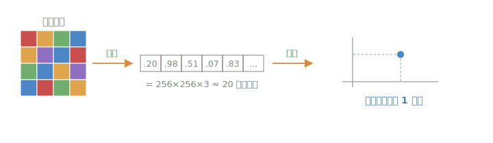
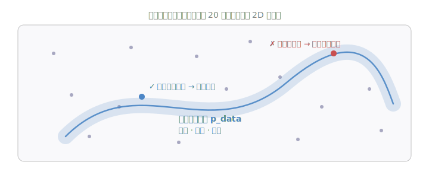
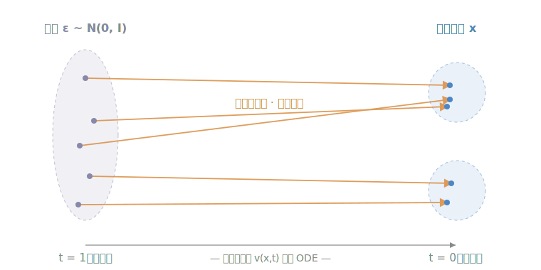
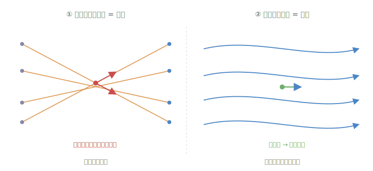

> 开一个新的「基础知识」系列，给之前的 [VLA 系列](/posts/smolvla-intro/)补补地基。第一篇讲 **Flow Matching**——它是 SmolVLA 生成动作、DIAMOND 去噪梦境背后的同一套机制。这篇尽量少堆公式、多讲直觉，读完你应该能看懂：为什么"从噪声到数据"可以是**一条直路**。

---

# 一、问题：生成一张图，到底难在哪

我们以「生成一张图片」为例，一步步看清楚要解决的到底是什么问题。

## 1.1 一张图，就是一串数字

计算机眼里没有"图片"，只有数字。一张 256×256 的彩色图，每个像素有 R、G、B 三个数值，加起来 256×256×3 ≈ **20 万个数字**。把这些数字按顺序排成一长串，一张图就变成了一个**长度 20 万的向量**——也就是 **20 万维空间里的一个点**。

<figure style="margin:1.4rem 0;">

<figcaption style="text-align:center;color:var(--secondary,#8B95A8);font-size:.9em;margin-top:.4rem;">把图像的所有像素值排成一串，一张图 = 一个高维向量 = 高维空间里的一个点。</figcaption>
</figure>

于是"生成一张图"就等价于一件事：**在这个 20 万维的空间里，找出一个点。**

## 1.2 但绝大多数点，都是噪声

麻烦在于，这个空间大得吓人，而**看起来像样的图片只占其中极小、极特殊的一小撮**。你随手取一个点（随机 20 万个数字），几乎 100% 得到的是一屏雪花噪点，而不是一只猫或一张脸。

所有"真实、像样的图片"聚在一起，构成一个又**窄**、又**弯**、又**复杂**的区域——这就是我们想要的数据分布 \(p_{\text{data}}\)：

<figure style="margin:1.4rem 0;">

<figcaption style="text-align:center;color:var(--secondary,#8B95A8);font-size:.9em;margin-top:.4rem;">真实图像只落在一条狭窄、弯曲的"带子"上（数据分布 p_data）；空间里绝大多数点都是噪声。</figcaption>
</figure>

## 1.3 两个都很难的难题

想生成像样的图，就得跟这个 \(p_{\text{data}}\) 打交道。可它有两个都很要命的难处：

- **难以建模**：我们写不出它的公式。没人说得清"一张图长得像真图"到底该满足什么精确的数学条件。
- **难以采样**：就算把它摆在面前，也没法直接从里面"抽"一个点出来——它太复杂、太不规则了。

直接硬啃 \(p_{\text{data}}\)，此路不通。

## 1.4 换个思路：让简单分布「长成」复杂分布

那就换个方向。有一个分布，我们**又会建模、又会采样**——高斯噪声 \(\mathcal{N}(0,I)\)：公式人人会写，采样就是 `randn()` 一行代码。

于是有了一个漂亮的主意：

> 别去硬碰复杂分布。而是**从简单的高斯噪声出发，构造一个"演化过程"，让这一整片简单分布，一点点长成我们要的复杂数据分布。**

只要这个演化过程建好了，两个难题**一起**被解决：

- **采样**？先从高斯里 `randn()` 抽一个点（简单），再让它跟着演化过程跑到终点，就落进了数据分布；
- **建模**？我们自始至终没有显式写出 \(p_{\text{data}}\) 的公式——它被**隐式地编码**在了"演化过程"里。

而 **Flow Matching，就是构造这个演化过程的一种既简单又优雅的办法。** 下面就来看它怎么建。

---

# 二、直觉：速度场与 ODE

那个"演化过程"具体该怎么描述？最好懂的方式，是想象一个粒子：它此刻停在一个噪声点 \(\varepsilon\) 上，我们要把它挪到某个数据点 \(x\)。

如果在每个位置、每个时刻，都有一个**速度场** \(v(x,t)\) 告诉这个粒子"下一步往哪挪、挪多快"，那粒子只要跟着这个速度走，就能从噪声流到数据。用微分方程写出来就是一个 **ODE（常微分方程）**：

$$
\frac{dx}{dt} = v(x, t)
$$

<figure style="margin:1.4rem 0;">

<figcaption style="text-align:center;color:var(--secondary,#8B95A8);font-size:.9em;margin-top:.4rem;">整片噪声分布(左)沿着速度场，流成数据分布(右)。每个噪声点各自走一条路径，汇成目标分布。</figcaption>
</figure>

注意：不是一个点在动，而是**整片噪声分布**在这个速度场的推动下，整体流成了数据分布。**Flow Matching 要学的，就是这个速度场 \(v_\theta(x,t)\)。**

问题来了：这个速度场该长什么样？我们又没有"正确答案"可以照着学。

---

# 三、最简单的路径：连一条直线

Flow Matching 有个漂亮的地方：**路径是可以我们自己选的。** 既然要从噪声 \(\varepsilon\) 到数据 \(x\)，最简单的选择就是——**连一条直线**。

用一个时间参数 \(t\in[0,1]\) 在两点之间线性插值（这里沿用 SmolVLA 的约定，\(t=1\) 是噪声、\(t=0\) 是数据）：

$$
x_t = t\,\varepsilon + (1-t)\,x
$$

- \(t=1\)：\(x_t = \varepsilon\)，纯噪声；
- \(t=0\)：\(x_t = x\)，干净数据。

这条直线上的速度是多少？对 \(t\) 求个导就出来了，而且是**常数**：

$$
u_t = \frac{dx_t}{dt} = \varepsilon - x
$$

一条直线，速度自然恒定——这就是图里那些橙色箭头想表达的：**每一对 (噪声, 数据) 都由一条匀速直线连着。** 沿这条线走，就完成了搬运。

---

# 四、训练目标：让网络回归速度场

但真到用的时候，我们手里只有一个噪声点，并**不知道它该连到哪个数据点**——那条理想直线是未知的。怎么办？

答案是：**训练一个神经网络去预测这个速度。** 每一步训练：

1. 从数据集里取一个真实样本 \(x\)；
2. 采一个噪声 \(\varepsilon\sim\mathcal{N}(0,I)\)、一个随机时间 \(t\)；
3. 拼出插值点 \(x_t = t\varepsilon+(1-t)x\)；
4. 让网络 \(v_\theta(x_t,t)\) 去预测这一对的速度 \(u_t=\varepsilon-x\)。

损失就是最朴素的均方误差：

$$
\mathcal{L} = \mathbb{E}_{x,\varepsilon,t}\Big[\,\big\| v_\theta(x_t, t) - (\varepsilon - x) \big\|^2 \,\Big]
$$

这里有个"魔法"值得点一句：同一个 \(x_t\) 其实可能来自很多不同的 \((\varepsilon, x)\) 组合，每组给的目标速度都不一样。但当你对所有这些目标取均值去回归，**网络学到的恰好是正确的、整体的速度场**（这就是 conditional flow matching 的核心结论）。你不需要知道"真正的配对"，只管回归条件速度就行。

这段话听起来抽象，但代码极其简单。这就是 SmolVLA 动作头的**真实**训练代码（`modeling_smolvla.py`）：

```python
# 采样噪声 ε 和时间 t
noise = self.sample_noise(actions.shape, actions.device)
time  = self.sample_time(actions.shape[0], actions.device)

# 在“数据 actions”和“噪声 noise”之间线性插值，得到 x_t
time_expanded = time[:, None, None]
x_t = time_expanded * noise + (1 - time_expanded) * actions   # x_t = t·ε + (1−t)·a
u_t = noise - actions                                         # 目标速度 u_t = ε − a

# 网络预测速度 v_t，再和 u_t 算 MSE
# ...过动作专家、交叉注意到 VLM 的 KV cache...
v_t = self.action_out_proj(suffix_out)
losses = F.mse_loss(u_t, v_t, reduction="none")
```

一行 `x_t = t·noise + (1-t)·actions` 是插值，一行 `u_t = noise - actions` 是目标速度，一行 `F.mse_loss` 是全部损失。**和上面的公式一一对应。** 只不过 SmolVLA 的"数据"是机器人动作块，而且网络还额外看着相机画面和语言指令（作为条件）。

---

# 五、为什么「取平均」能学到正确的速度场？

上一节末尾我埋了一句"魔法"：同一个 \(x_t\) 可能来自很多对 \((\varepsilon, x)\)，每对给的目标速度都不一样，但对它们取均值去回归，网络学到的**恰好是正确的速度场**。这一节把它讲透——**先证明它，再图解它。**

## 5.1 一个看似矛盾的地方

设想空间里某个具体的点 \(z\)、某个时刻 \(t\)。可能有很多对 \((\varepsilon, x)\)，它们的直线路径恰好都在 \(t\) 时刻经过 \(z\)（即 \(x_t = z\)）。每一对都想让这里的速度等于自己的 \(\varepsilon - x\)——而这些值**彼此不同、互相冲突**。

可网络 \(v_\theta(z,t)\) 在同一个点上只能吐出**一个**速度。它到底会学成哪个？

## 5.2 证明：平方误差的最优解 = 条件期望

答案藏在损失函数的形状里。把损失聚焦到固定的 \((z,t)\)，记这里的目标速度为随机变量 \(U=\varepsilon-x\)（随经过该点的不同 pair 而变），网络输出为 \(v\)。这一点贡献的损失是一个条件期望：

$$
\ell(v) = \mathbb{E}\big[\, \|v - U\|^2 \,\big|\, x_t = z \,\big]
$$

把平方展开：

$$
\ell(v) = \|v\|^2 - 2\, v^\top\, \mathbb{E}[U \mid x_t=z] + \mathbb{E}\big[\|U\|^2 \mid x_t=z\big]
$$

对 \(v\) 求梯度、令其为零：

$$
\nabla_v \ell = 2v - 2\,\mathbb{E}[U \mid x_t=z] = 0 \quad\Longrightarrow\quad v^\star = \mathbb{E}[U \mid x_t = z]
$$

于是在每个点 \((z,t)\)，网络的最优输出，就是那些冲突目标的**条件期望（后验加权平均）**：

$$
v_\theta^\star(z, t) = \mathbb{E}\big[\, \varepsilon - x \,\big|\, x_t = z \,\big] \;=:\; u_t(z)
$$

MSE 回归天生就会把一堆冲突目标"抹平"成它们的均值——这不是巧合，而是平方损失的固有性质。（等价的一行推导：\(\mathbb{E}\|v-U\|^2 = \|v-\mathbb{E}U\|^2 + \mathrm{Var}(U)\)，右边只有第一项跟 \(v\) 有关，在 \(v=\mathbb{E}U\) 时取零。）

## 5.3 这个平均，恰好就是对的那个场

到这里只证明了"网络会收敛到条件期望"。但凭什么这个期望 \(u_t(z)\) 就是能把噪声分布搬成数据分布的**那个正确速度场**？

这正是 Flow Matching 的核心定理（Lipman et al., 2022）所保证的：**由条件路径按后验加权平均得到的边缘速度场 \(u_t(z)\)，恰好生成边缘概率路径 \(p_t\)**（即它满足把 \(p_t\) 从噪声演化到数据的连续性方程）。直觉上也不难理解：每条条件路径都在"合规地"搬运自己那一份概率质量，把它们按真实占比叠加起来，整体的质量流动自然就对了。我们不展开这部分的 PDE 推导，只记住结论：**回归条件速度 = 学到边缘速度场 = 正确的搬运。**

## 5.4 代价：直线被「掰弯」了

这个"取平均"有一个非常直观、也非常重要的几何后果。

我们当初**设计**的是一根根**直线**：每对 \((\varepsilon, x)\) 一条。可不同对的直线会在空间里**彼此交叉**。而在交叉点上，两条直线各自带着一个不同方向的速度——但边缘速度场在这一点只能有**一个**值（就是 5.2 证出来的那个平均）。

一个单值的、足够正则（Lipschitz）的速度场，它的积分曲线（ODE 的解）是**唯一**且**互不相交**的——否则同一点就会有两个前进方向。于是结论只能是：**为了不相交，真正被网络学到、并在采样时走出来的轨迹，只能是弯曲的。**

<figure style="margin:1.4rem 0;">

<figcaption style="text-align:center;color:var(--secondary,#8B95A8);font-size:.9em;margin-top:.4rem;">左：条件路径是直线、彼此交叉，交叉点上速度"打架"。右：取期望后速度场单值，积分轨迹只能弯曲绕行、互不相交。<b>设计是直的，实际是弯的。</b></figcaption>
</figure>

这也顺带解释了一个进阶话题的动机：既然直线被掰弯、采样就得多走几步，那能不能**反复重训、把弯掉的轨迹再"捋直"**？——这正是 Rectified Flow 的思路，不过那是后话了。

---

# 六、采样：解一次 ODE 就到数据

训练好之后怎么生成？很直接：**从纯噪声出发，跟着学到的速度场把 ODE 解一遍。**

从 \(t=1\)（噪声）积分到 \(t=0\)（数据），用最朴素的欧拉法，一步步挪：

$$
x_{t-\Delta t} = x_t \;-\; \Delta t\cdot v_\theta(x_t, t)
$$

对应的真实采样循环（SmolVLA 的去噪，`dt` 取负、从噪声走向数据）：

```python
x_t = noise                          # 从纯噪声开始
for _ in range(num_steps):
    v_t = self.denoise_step(x_t, ...)  # 网络预测当前速度场
    x_t = x_t + dt * v_t               # 欧拉法积分一步
return x_t                            # 得到最终的动作块
```

因为我们当初特意选了**直线**路径，速度场比较"平直"，所以采样**不需要很多步**——往往几步、十几步就够。这正是 Flow Matching 相比传统扩散的一大实际好处。

---

# 七、Flow Matching vs 扩散模型

两者其实是近亲——都在噪声和数据之间做搬运。但视角不同：

| | 扩散模型（DDPM 类） | Flow Matching |
|---|---|---|
| 路径怎么来 | 由固定的随机加噪过程（SDE）隐式决定 | **自己选**，常用直线 |
| 网络学什么 | 分数 / 噪声（score） | **速度场** \(v_\theta\) |
| 采样 | 通常需要较多步 | 直线路径 → **步数少** |
| 目标函数 | 需要推导的加权项 | 一个朴素的 MSE |

可以把 Flow Matching 理解成一个更简洁、更自由的框架：**你先画好从噪声到数据的路径，再让网络去学这条路径上的速度。** 传统扩散其实可以看成它在某种特定（弯曲）路径下的特例。

---

# 小结

一句话收束整篇：

> **Flow Matching = 在噪声和数据之间连直线，训练网络回归这条直线上的恒定速度；生成时从噪声出发、跟着速度场把 ODE 解一遍就到数据。**

这套机制你已经在 VLA 系列里见过它干活了——[SmolVLA](/posts/smolvla-intro/) 用它生成 50 步的动作块，[DIAMOND](/posts/world-model-diamond/) 用同源的去噪"梦"出下一帧。理解了这一篇，回头再看那两篇的代码会顺很多。

有问题或想法，欢迎在下面留言。
