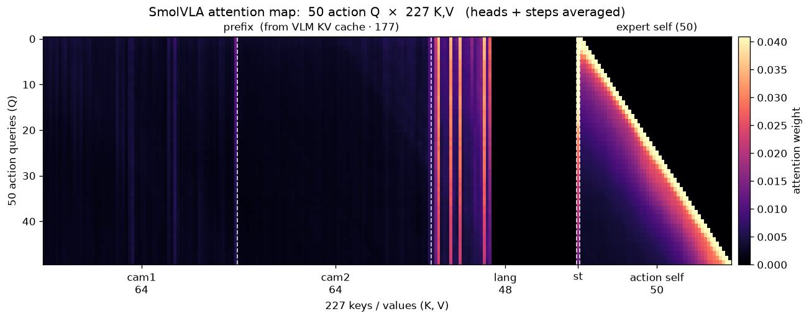
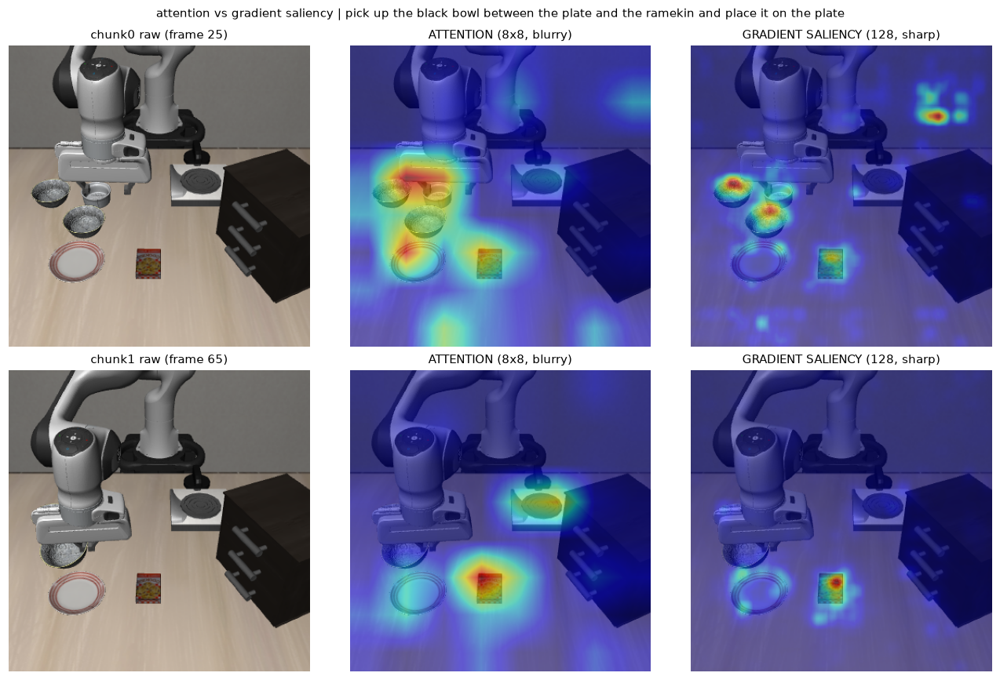
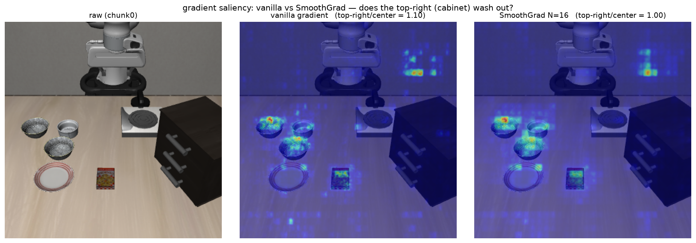
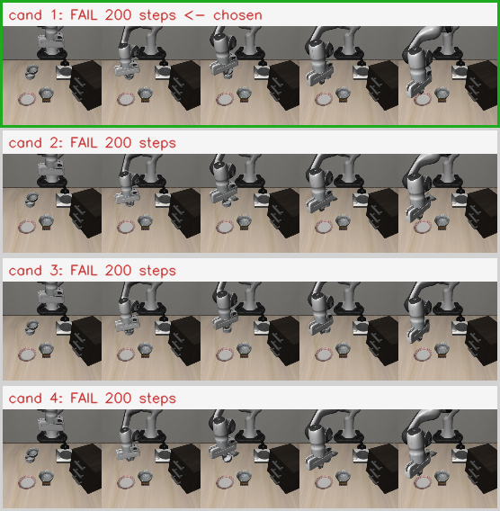
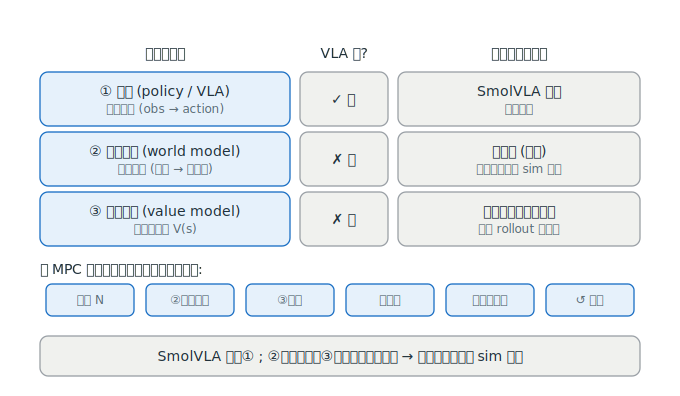

> 这是 VLA 系列的第二篇。[上一篇](/posts/smolvla-intro/)我们拆了 SmolVLA 的架构，并埋下一个钩子：它靠"看一眼、走几步、再看一眼"干活，但**这个环其实并没有真正闭上**——它从不预测"如果我这样动，世界会变成什么样"。
>
> 这一篇我们换个角度逼问它：**执行那一刻，模型到底在看画面里的哪一块？** 撬开这个黑盒，你会看到一些"它盯着的地方并不是它该抓的东西"的现象——那正是通往世界模型的一道缝。

---

# 一、注意力可视化：模型"注意"到了什么

最直接的想法：既然动作专家是通过**交叉注意力**去读 VLM 的画面理解，那把这些注意力权重抠出来看看，不就知道它在看哪了吗？

## 1.1 从哪抠：hook 住 eager_attention_forward

回顾第一篇：50 个动作 token 交叉注意到 177 个前缀 token。我给 SmolVLA 的注意力函数打了个补丁，专门捕获这一步（`q_len=50, kv_len=177`）的注意力概率：

```python
def install_capture(policy):
    """给 policy 的 VLM 注意力打补丁，捕获 action→prefix 的注意力 probs。"""
    from lerobot.policies.smolvla.smolvlm_with_expert import SmolVLMWithExpertModel
    captured = []
    orig = SmolVLMWithExpertModel.eager_attention_forward

    def capturing(self, attention_mask, batch_size, head_dim,
                  query_states, key_states, value_states):
        # ...GQA: 把 num_key_value_heads 展开到 num_attention_heads...
        aw = torch.matmul(q, kf.transpose(2, 3)) * head_dim**-0.5
        masked = torch.where(attention_mask[:, None, :, :], aw, big_neg)
        probs = F.softmax(masked, dim=-1)
        # 只捕获 action(50) -> prefix(177) 这一步
        if probs.shape[2] == 50 and probs.shape[3] == 177:
            captured.append(probs[0].detach().cpu().float())   # (heads, 50, 177)
        # ...照常算 attention 输出并返回...
    SmolVLMWithExpertModel.eager_attention_forward = capturing
    return captured, restore
```

一次 `select_action` 会触发多层 × 多个去噪步的注意力，所以 `captured` 里有很多张 `(heads, 50, 177)`。

## 1.2 完整的注意力长这样

先把一次调用里所有捕获的注意力，对 **头（heads）和去噪步** 做平均，画出 50 个动作 query 对全部 227 个 key（= 177 前缀 + 50 动作自注意力）的完整图景：

<figure style="margin:1.4rem 0;">

<figcaption style="text-align:center;color:var(--secondary,#8B95A8);font-size:.9em;margin-top:.4rem;">50 动作 query × 227 key 的注意力(头与去噪步已平均)。可见三种结构：右侧动作自注意力的<b>因果三角</b>、语言段的<b>竖条锚定</b>、以及相机段<b>弥散而暗</b>的视觉注意力。</figcaption>
</figure>

三个可读的结构：

- **因果三角**（右侧 `action self` 区）：动作 token 只能注意到自己之前的动作，标准的因果掩码。
- **语言锚定**（`lang` 段）：几条明亮的竖线——某些指令词被稳定地重点关注。
- **视觉弥散**（`cam1 / cam2` 段）：一大片暗、且分布很散。**这里就是问题所在。**

## 1.3 把视觉注意力还原成 8×8 网格

每路相机是 64 = 8×8 个 token，可以还原成一张空间热图。聚合代码的关键在这一步平均：

```python
stacked = torch.stack(captured, 0)      # (N层×去噪步, heads, 50, 177)
attn = stacked.mean(dim=(0, 1, 2))      # 对 N、heads、50个动作query 全平均 -> (177,)
cam1_grid = attn[0:64].reshape(8, 8)    # 主相机 8×8
cam2_grid = attn[64:128].reshape(8, 8)  # 腕部相机 8×8
lang_attn = attn[128:176]               # 语言 48 维
```

注意这个 `mean(dim=(0,1,2))`：它把 **N 层、所有注意力头、50 个动作步** 全都平均掉了。这正是下面这个"糊"的根源。

---

# 二、一个尴尬的发现：注意力指不准目标

把主相机的注意力热图叠回画面上，问题就暴露了。指令是 *"pick up the black bowl between the plate and the ramekin and place it on the plate"*：

<figure style="margin:1.4rem 0;">

<figcaption style="text-align:center;color:var(--secondary,#8B95A8);font-size:.9em;margin-top:.4rem;">同一帧：中间是注意力(soft, blurry)，右边是梯度归因(sharp)。注意力糊成一大团、盖住了好几个碗，说不清到底在抓哪个。</figcaption>
</figure>

我当初的质疑很简单：**注意力热区里那个碗，压根不是它要抓的那个。** 热图糊成一片，同时盖住好几个物体，你没法用它回答"模型此刻在操作哪个目标"。

**为什么会糊？** 就是 1.3 里那个平均。注意力被**多头平均 + 50 个动作步平均**抹平了：不同的头、不同的去噪阶段各看各的，一平均就成了一团弥散的云。raw attention 作为"模型在看哪个物体"的证据，**不可靠**。

需要一把更锋利的刀。

---

# 三、梯度归因：换一把更锋利的刀

注意力回答的是"信息从哪流过"，而我们真正想问的是：**画面里哪个像素改一改，动作就会跟着变？** 这正是梯度归因（gradient saliency）干的事。

## 3.1 做法：对像素求导

对模型**实际输入的相机图像**开 `requires_grad`，跑一遍可微的 `sample_actions`，再对首步动作反向传播，取 \(|\partial \text{action} / \partial \text{pixel}|\)：

```python
images = [im.detach().requires_grad_(True) for im in images]
# 固定去噪噪声，保证可比、可复现
actions = policy.model.sample_actions(images, img_masks, lang_tokens,
                                      lang_masks, state, noise=fixed_noise)
target = actions[:, 0, :adim].abs().sum()     # 首步动作向量的总幅度
grads = torch.autograd.grad(target, images)   # ∂action / ∂pixel
saliency = grads[0].abs().sum(dim=1)[0]        # 通道求和 -> (H, W) 全分辨率
```

写成一句话：

$$
S(x,y) \;=\; \sum_{c}\left| \frac{\partial \big(\sum_i |a_i^{(0)}|\big)}{\partial\, \text{pixel}(x,y,c)} \right|
$$

它比注意力好在两点：**① 全分辨率**（不是 8×8，而是原图那么细）；**② 直接对输出负责**（衡量的是"改这个像素会不会真的改变动作"，而非中间的信息路由）。

回看上面那张对比图右列：梯度归因**锐利、聚焦**，比糊成一团的注意力干净得多。

## 3.2 但是——它高亮的地方有点可疑

梯度归因锐利了，却带出一个更有意思的问题：它有时会**强烈高亮画面右上角的柜子**，而那玩意儿跟"抓碗放盘子"毫无关系。这是真实依赖，还是单次梯度的噪声伪影？

# 四、SmoothGrad：这个高亮是真的吗？

单次梯度天生带噪。**SmoothGrad** 的思路是：给输入加 \(N\) 次小随机噪声，各求一次梯度再平均——真实的依赖会稳稳留下，噪声伪影会被平均掉。

$$
S_{\text{smooth}}(x,y) = \frac{1}{N}\sum_{k=1}^{N} S\big(\,\text{image} + \mathcal{N}(0,\sigma^2)\,\big)(x,y)
$$

于是我做了个受控对比：右上柜子的高亮，在 SmoothGrad（N=16）之后会不会被"洗掉"？

<figure style="margin:1.4rem 0;">

<figcaption style="text-align:center;color:var(--secondary,#8B95A8);font-size:.9em;margin-top:.4rem;">原图 / 单次梯度(右上柜子相对强度 1.10) / SmoothGrad N=16(右上 1.00)。柜子的高亮没被洗掉——它是模型的真实依赖。</figcaption>
</figure>

结论是：**没洗掉。** 右上柜子的相对强度从 1.10 到 1.00，基本稳住了。这说明模型**真的在依赖那个柜子**——它把"柜子在右上角"当成了判断场景、决定动作的一条线索。

这是一种**场景锚定 / 伪相关（spurious correlation）**：模型不只是在"看目标物体"，它还悄悄记住了"这个任务的场景长这样、柜子该在那儿"。一旦换个布局，这种依赖可能就让它翻车。**这正是纯模仿策略的软肋**——它学的是"这个场景里怎么动"，而不是"世界的因果"。

---

# 五、从"挑运气"到"造工具"：best-of-N 与世界模型的缺口

既然单条轨迹靠不住，一个朴素的补救是 **best-of-N 规划**：同一个局面下采样 \(N\) 个不同的计划，各跑一遍，挑最好的那个。

## 5.1 一个差点骗过我的方法论坑

我先说个教训，因为它差点让我得出**完全相反**的结论。

第一版分析里，我拿"候选 0"当作"不用规划的基线"，去和 best-of-5 比。结果显示"规划几乎没用"。但这是**错的**——候选 0 只是 N 个随机样本里的一个，用它当基线，等于拿一次随机结果去比五次里挑最好的，基准被系统性高估了。

正确的基线是 **"期望单次成功率"**（N 个候选各自成功率的平均）。换了这个指标，结论直接翻转：

| n_action_steps | 单次成功率(正确基线) | best-of-5 | 净提升 |
|---|---|---|---|
| 50 | 76% | 90% | **+14pt** |
| 25 | 88% | 90% | +2pt |

**选错指标会翻转结论。** 这是我在这个项目里记得最深的一课：可解释性和实验分析里，"跟谁比"往往比"结果是多少"更要命。

## 5.2 best-of-N 只是挑运气

修正后的数字讲了个清楚的故事：

- 规划确实有用（+14pt），但**策略本身越稳，规划的边际价值越小**（nas=25 时只剩 +2pt）。
- 所有配置都**卡在 90% 的天花板**——best-of-N 救不了 task5 这种"能力短板"（它需要更紧的闭环，不是更多的候选）。

更根本的问题：best-of-N **只是在挑运气**。而且在真机上它**根本不可行**——你没法"同一个局面重来 5 次"，那 5 次的代价都是真实付出的。

<figure style="margin:1.4rem 0;">

<figcaption style="text-align:center;color:var(--secondary,#8B95A8);font-size:.9em;margin-top:.4rem;">best-of-N 的选择可视化：4 个候选各跑一遍，绿框是被选中的那个。这个例子里 4 个全失败——best-of-N 挑不出超过能力上限的结果。</figcaption>
</figure>

## 5.3 三零件框架：SmolVLA 缺了什么

把"规划"这件事拆开，需要三个零件：

<figure style="margin:1.4rem 0;">

<figcaption style="text-align:center;color:var(--secondary,#8B95A8);font-size:.9em;margin-top:.4rem;">规划三零件：①策略 ②世界模型 ③价值模型。SmolVLA 只有①；本项目用"真仿真"顶替②、用"完整 rollout"顶替③——所以环只在 sim 里闭得上。</figcaption>
</figure>

- **① 策略（policy / VLA）**：提议动作（obs → action）。SmolVLA ✅ 有。
- **② 世界模型（world model）**：想象未来（动作 → 下一帧）。SmolVLA ✗ **缺**。我这里是拿"真仿真"当占位——真跑一遍，不是"想象"。
- **③ 价值模型（value model）**：给状态/结果打分。SmolVLA ✗ **缺**。我这里是拿"完整 rollout 的成败"当评分。

真正的 MPC 规划循环（提议 N → **想象**结果 → 打分 → 选最优 → 执行第一步 → 重来）要三个零件都到齐才成立。SmolVLA 只占①，②③我都用"真实仿真"硬顶了过去——**所以这个环，只在仿真里闭得上，真机上闭不上。**

---

# 结语：通往世界模型

这一篇我们做了两件事：

1. **撬开黑盒**：注意力糊、指不准目标（多头+多步平均的锅）；梯度归因更锐，但暴露出模型对**场景布局的伪相关依赖**（SmoothGrad 证明它是真实的，不是噪声）。
2. **逼到边界**：best-of-N 只能挑运气、真机不可行；SmolVLA 在"三零件框架"里只占了①策略这一格。

一句话收束整件事：**我们看到了奖品（选择更优计划的价值），却还没造出领奖品的工具——一个能在"脑子里"想象未来、而不必真跑一遍的神经世界模型。**

那个工具，就是下一篇的主角。**世界模型，登场。**
