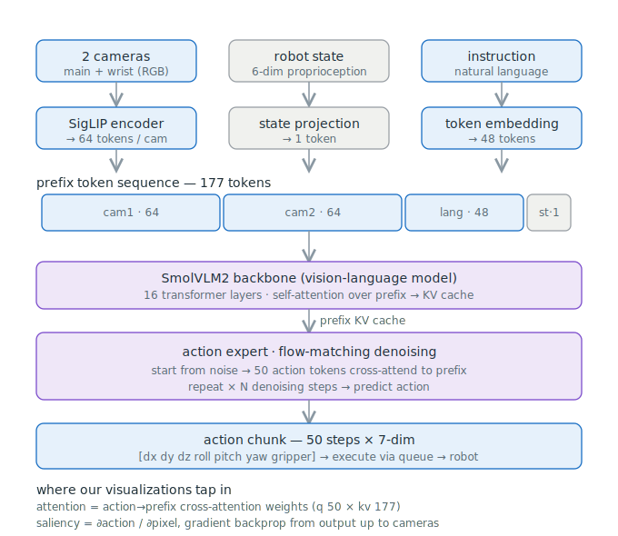
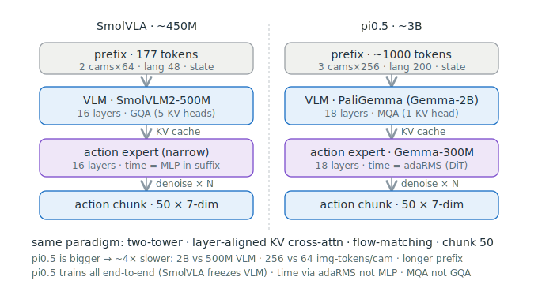
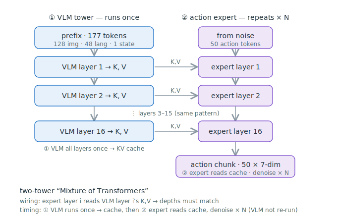
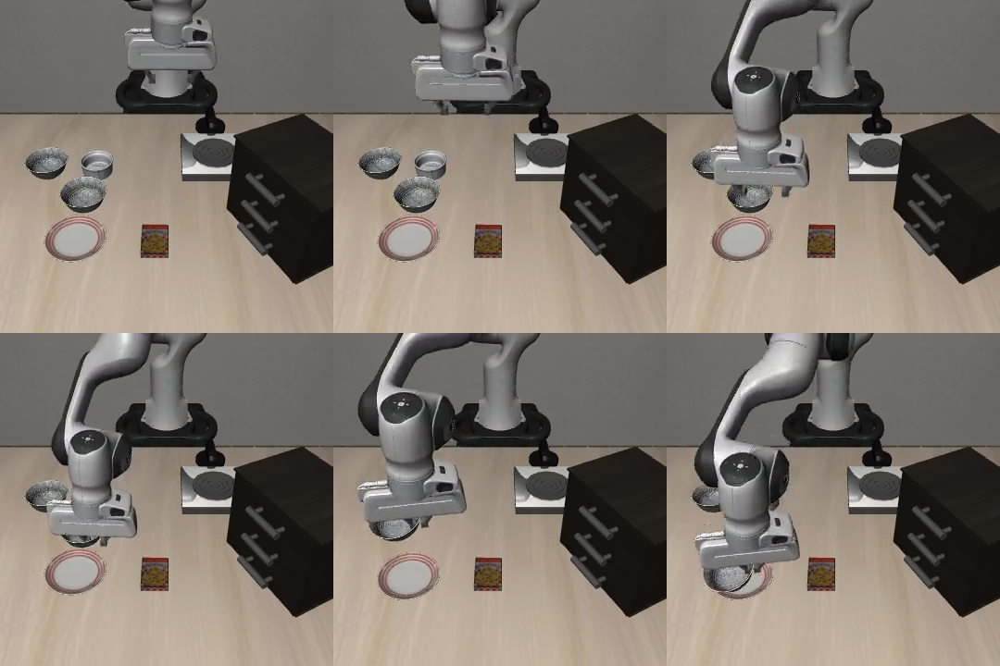

> 这是一个系列的第一篇。我想从 **VLA（Vision-Language-Action，视觉-语言-动作）模型**入门，一步步过渡到**世界模型（World Model）**。选 SmolVLA 开场，是因为它只有 450M、能在一台 MacBook 上本地跑通，是理解"策略（policy）"这一环最省力的切入点。
>
> 先埋一个钩子：SmolVLA 是一个**纯模仿策略**——它把"观测直接映射到动作"，靠"模仿 + 不断重新观测"绕开了对未来的建模。它身上**没有世界模型**。这个系列后面几篇，就是要顺着它的边界，走到世界模型那里去。

本文所有实验都在一台 **M5 Max / 128GB 的 MacBook Pro** 上完成，全程 Apple GPU（MPS），无 CUDA。

---

# 一、SmolVLA 是什么

SmolVLA 是 HuggingFace / LeRobot 在 2025 年发布的轻量级 VLA 模型（论文 *SmolVLA: A Vision-Language-Action Model for Affordable and Efficient Robotics*，arXiv:2506.01844）。一句话概括它干的事：

> 把 **多路摄像头画面 + 机器人本体状态 + 一句自然语言指令**，映射成一段 **动作序列（action chunk）**。

<figure style="margin:1.4rem 0;">

<figcaption style="text-align:center;color:var(--secondary,#8B95A8);font-size:.9em;margin-top:.4rem;">SmolVLA 整体数据流：两路相机 + 状态 + 指令 → 177-token 前缀 → VLM 骨干 → 动作专家去噪 → 50 步动作块</figcaption>
</figure>

它的"卖点"是**平价高效**：约 **450M 参数**（权重约 865MB），缓存之后单步推理只要约 **0.06 秒**。论文标题里的 "Affordable" 不是虚的——它真的能在消费级笔记本上跑。

作为对照，同一范式下更大的 **π0.5** 约 **3B 参数**，能力更强但慢约 **4 倍**：

<figure style="margin:1.4rem 0;">

<figcaption style="text-align:center;color:var(--secondary,#8B95A8);font-size:.9em;margin-top:.4rem;">同一范式、不同体量：SmolVLA(500M VLM / 64 img-token 每相机) vs π0.5(2B VLM / 256 img-token 每相机)</figcaption>
</figure>

两者是**同一套范式**：双塔结构、层对齐的 KV 交叉注意力、flow-matching 去噪、chunk 长度 50。差别只在体量与若干工程选择（π0.5 端到端训练、时间条件用 adaRMS/DiT、注意力用 MQA；SmolVLA 冻结 VLM、时间条件用 MLP、注意力用 GQA）。**吃透了 SmolVLA，π0.5 这类模型就是"放大版"。**

---

# 二、架构剖析

## 2.1 双塔："宽 VLM + 窄动作专家"

SmolVLA 是一个 **Mixture of Transformers（双塔）**：

- **VLM 塔（宽）**：一个视觉-语言模型骨干 **SmolVLM2-500M**，16 层，负责"看懂画面 + 读懂指令"。
- **动作专家塔（窄）**：一个更瘦的 Transformer，同样 16 层，负责"把理解翻译成动作"。

关键的"接线规则"：**动作专家的第 \(i\) 层，读取 VLM 第 \(i\) 层输出的 K、V**做交叉注意力。所以两塔**层数必须对齐**。

## 2.2 时序：VLM 只跑一次，动作专家反复去噪

很多人第一反应是"两塔逐层交错跑"，其实不是。真实的时序是**先后**的：

<figure style="margin:1.4rem 0;">

<figcaption style="text-align:center;color:var(--secondary,#8B95A8);font-size:.9em;margin-top:.4rem;">① VLM 全部 16 层跑一次 → 生成 KV cache；② 动作专家反复读这份 cache，去噪 ×N 次。VLM 不重跑。</figcaption>
</figure>

1. **① VLM 塔跑一次**：把前缀（下面讲）过完 16 层，把每层的 K、V 缓存下来（KV cache）。
2. **② 动作专家反复去噪**：从纯噪声出发，50 个动作 token 交叉注意到那份 cache，迭代去噪 \(N\) 次，最终吐出动作。

因为 VLM 只跑一次、后面 \(N\) 步去噪都复用 cache，这就是它推理快的关键。

## 2.3 前缀布局：177 个 token 是怎么来的

VLM 塔的输入是一串"前缀 token"。我写了个探针 hook 实测了它的构成，正好是 **177 个**：

$$
\underbrace{[\text{cam1}: 64]}_{\text{主相机 8×8}} \;+\; \underbrace{[\text{cam2}: 64]}_{\text{腕部相机 8×8}} \;+\; \underbrace{[\text{lang}: 48]}_{\text{指令分词}} \;+\; \underbrace{[\text{state}: 1]}_{\text{本体状态}} \;=\; 177
$$

- 每路相机经视觉编码后压成 **8×8 = 64 个 token**；两路相机共 128 个。
- 语言指令占 **48 个 token**。
- 6 维本体状态（proprioception）经一个投影层压成 **1 个 token**。

## 2.4 动作头：flow matching（流匹配）去噪

动作不是一步算出来的，而是像扩散模型那样**从噪声迭代去噪**得到。SmolVLA 用的是 **flow matching**。训练时的核心就几行，直接看 LeRobot 源码（`modeling_smolvla.py`）：

```python
# 采样噪声 ε 和时间 t
noise = self.sample_noise(actions.shape, actions.device)
time  = self.sample_time(actions.shape[0], actions.device)

# 在“干净动作 a”与“噪声 ε”之间线性插值，构造带噪样本 x_t
time_expanded = time[:, None, None]
x_t = time_expanded * noise + (1 - time_expanded) * actions   # x_t = t·ε + (1−t)·a
u_t = noise - actions                                         # 目标速度场 u_t = ε − a

# 动作专家读 x_t 和 t，预测速度场 v_t
suffix_embs, *_ = self.embed_suffix(x_t, time)
# ...过动作专家、交叉注意到 VLM 的 KV cache...
v_t = self.action_out_proj(suffix_out)

# 损失：让预测的 v_t 逼近真实速度场 u_t
losses = F.mse_loss(u_t, v_t, reduction="none")
```

写成公式，训练目标是让网络 \(v_\theta\) 拟合从"干净动作"指向"噪声"的**速度场**：

$$
x_t = t\,\varepsilon + (1-t)\,a, \qquad u_t = \varepsilon - a, \qquad
\mathcal{L} = \big\| \, u_t - v_\theta(x_t,\, t,\, \text{prefix}) \, \big\|^2
$$

一个容易忽略的细节：时间 \(t\) 不是均匀采样，而是从一个 **Beta 分布**采（`sample_time` 里 `time_beta * 0.999 + 0.001`），让训练更偏向去噪轨迹的某些阶段。

**推理**时反过来：从纯噪声 \(x_t=\varepsilon\) 出发，用欧拉法沿速度场往回积分若干步：

```python
x_t = noise
for _ in range(num_steps):
    v_t = self.denoise_step(x_t, ...)   # 动作专家预测速度
    x_t = x_t + dt * v_t                # 欧拉积分一步
return x_t                              # 得到 50×7 的动作块
```

## 2.5 输出：50 步 × 7 维的动作块

最终输出是一个 **chunk_size = 50** 的动作块，每步 **7 维**：

$$
[\,dx,\ dy,\ dz,\ \text{roll},\ \text{pitch},\ \text{yaw},\ \text{gripper}\,]
$$

即末端执行器的平移增量、姿态增量，加一个夹爪开合。这 50 步会被塞进一个执行队列发给机器人。

这里埋下一个**关键区别**，下一节的实验就围绕它：

- **chunk_size = 50**：训练时定死的动作块长度。
- **n_action_steps**：推理时**真正执行几步就停下来、重新观测再规划**。这是可调的"闭环粒度"。

`chunk_size` 是模型一次能想多远，`n_action_steps` 是你让它埋头走多久才抬头看一眼。

---

# 三、在 Mac 上把它跑起来

## 3.1 一条命令跑评测

SmolVLA 在 [LeRobot](https://github.com/huggingface/lerobot) 里开箱即用。核心就是 `lerobot-eval`，指定 MPS 设备、在 LIBERO 仿真里跑：

```bash
lerobot-eval \
  --policy.path="./models/smolvla_base" \
  --policy.device=mps \          # 关键：Apple GPU，不是 cuda
  --env.type=libero \
  --env.task=libero_spatial \    # 也可换 libero_object / libero_goal / libero_10
  --eval.batch_size=1 \
  --eval.n_episodes=10
```

跑起来就是机械臂在仿真里听指令干活：

<figure style="margin:1.4rem 0;">

<figcaption style="text-align:center;color:var(--secondary,#8B95A8);font-size:.9em;margin-top:.4rem;">LIBERO libero_spatial 里的一段 rollout：机械臂按指令抓取/摆放物体。</figcaption>
</figure>

## 3.2 Mac 上真正的坑不在算力，在生态

128GB 内存跑 450M 绰绰有余，**瓶颈从来不是内存，而是软件生态**——很多机器人栈默认假设你有 CUDA。踩过、也值得你避开的几个坑：

| 坑 | 解法 |
|---|---|
| LeRobot 要 Python ≥ 3.12 | 直接用 python 3.13 |
| HuggingFace 权重下载卡死 | 走 `hf-mirror.com` 镜像 + `curl` 直下 |
| mujoco 在 Mac 渲染黑屏/报错 | 设 `MUJOCO_GL=glfw` |
| 代码里设备写死 `cuda` | 用 `--policy.device=mps` 覆盖 |
| `torch.compile` 在 MPS 崩（NoValidChoicesError） | `export TORCHDYNAMO_DISABLE=1` 回退 eager |
| **`*_base` 权重几乎完不成任务** | 必须用 **LIBERO 微调过的 `_finetuned` 权重**——通用 base 缺归一化统计，动作空间对不上，这是最容易翻车的一个 |

一句话总结这段经验：**在 Mac 上做具身智能，选原生支持 MPS/MLX 的路子，别跟 CUDA 硬刚。**

---

# 四、实验：闭环粒度 n_action_steps 的甜点区

用微调后的 SmolVLA 在 **LIBERO libero_spatial**（10 个任务）上评测，基线成功率 **80%（8/10）**——失败的是 task 5 和 task 7。

现在动 2.5 节埋下的那个旋钮：**n_action_steps**，也就是"埋头走几步才重新观测规划一次"。所有实验**同任务、同初始状态、同噪声种子**，只变这一个量。

## 实验①：50 步一规划 → 10 步一规划

把 n_action_steps 从 50（走完整块才抬头）压到 10：

| 指标 | n=50 | n=10 |
|---|---|---|
| 成功率 | 80% (8/10) | **100% (10/10)** |
| 成功局平均步数 | 114.1 | **103.2（−约 10%）** |

紧一点的闭环直接**救回了原本失败的 task5 和 task6**；最戏剧的是 task2，从 169 步压到 98 步。原因很直观：走得越久不看环境，误差累积越多；勤看一眼就能及时纠偏。

## 实验②：甜点区在哪？

那是不是"越勤看越好"、一路压到逐帧（n=1）？扫描 {50, 25, 10, 5, 1}：

- 成功率**非单调**，**甜点区在 ~10–25**（n=25 时平均步数 96.3 最佳）。
- **逐帧闭环 n=1 既不是最优，还慢约 50 倍**——每步都重规划，把动作块的效率优势全丢了。

**结论**：`n_action_steps ≈ 10–25` 是这批任务的甜点区。这和模仿学习里 ACT、Diffusion Policy 关于 action horizon 的权衡是一致的——动作块给你效率和时序一致性，但块太长会牺牲对环境变化的响应。**改闭环粒度，改的是策略的"能力"**，而不只是速度。

---

# 小结与下一篇

这一篇我们把 SmolVLA 拆开看了一遍：

- **是什么**：450M 的轻量 VLA，观测 + 指令 → 50×7 动作块，能在 Mac 上本地跑。
- **架构**：双塔（宽 VLM + 窄动作专家）、VLM 跑一次生 KV cache、动作专家 flow-matching 去噪、177-token 前缀。
- **工程**：一条 `lerobot-eval` 跑通，Mac 的坑在生态不在算力。
- **实验**：闭环粒度 n_action_steps 的甜点区在 ~10–25，紧闭环能把成功率从 80% 拉到 100%。

但我们始终在"看一眼、走几步、再看一眼"——**这个环，其实并没有真正闭上**。模型从不预测"如果我这样做，世界会变成什么样"。

下一篇，我们换个角度逼问它：**模型执行时到底在看画面里的哪一块？** 用注意力可视化和梯度归因去撬开这个黑盒，你会看到一些"它盯着的地方并不是它该抓的东西"的有趣现象——那正是通往**世界模型**的一道缝。
