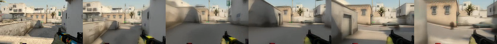

> VLA 系列第三篇。[第二篇](/posts/smolvla-interpretability/)的结尾我们逼到了一个缺口：SmolVLA 这样的纯模仿策略，**看到了「选择更优计划」的价值，却没有一个能在脑子里想象未来的工具**——它从不预测"如果我这样动，世界会变成什么样"。
>
> 这一篇，就把那个工具摆上台：**世界模型**。而且不讲空的——我在 Mac 上真跑了一个能「梦」出可玩 CSGO 的世界模型。

---

# 一、直觉：让神经网络「梦」出一个世界

先看东西。下面这段视频里的每一帧，**都不是游戏引擎渲染的，而是一个神经网络「想」出来的**：

<figure style="margin:1.4rem 0;">
<video src="images/diamond_csgo_dream.mp4" autoplay loop muted playsinline style="width:100%;max-width:720px;display:block;margin:0 auto;border-radius:6px;"></video>
<figcaption style="text-align:center;color:var(--secondary,#8B95A8);font-size:.9em;margin-top:.4rem;">DIAMOND 世界模型在 Mac(MPS) 上「梦」出的 CSGO 画面：我一直喂「按 W 前进 + 左右扫视鼠标」的动作，它自回归地生成了 50 帧。没有游戏引擎，全是神经网络生成。</figcaption>
</figure>

这就是 **DIAMOND**（*DIffusion As a Model Of eNvironment Dreams*，NeurIPS 2024）。它是一个**扩散世界模型**，干的事和 VLA 正好相反：

| | 映射 | 问的问题 |
|---|---|---|
| **VLA**（SmolVLA） | 画面 + 指令 → **动作** | "我该怎么动？" |
| **世界模型**（DIAMOND） | 画面 + 动作 → **下一帧** | "我这样动，世界会变成啥样？" |

## 1.1 我在 Mac 上跑的这一版

本项目用的是 DIAMOND 的 **CSGO（反恐精英）世界模型**分支：约 1.5GB 的扩散权重，在 **Apple GPU（MPS）** 上加载，不做训练、只做推理。我写了个无头脚本喂**脚本化动作**，让它一帧帧「梦」下去：

```python
obs, _ = play_env.reset()          # 从「出生点」条件帧开始
frames = [to_rgb(obs)]

for t in range(N):
    keys = [pygame.K_w]                                # 一直按 W 前进
    mouse_x = 10 if (t // 8) % 2 == 0 else -10         # 每 8 帧切换左右扫视
    action = CSGOAction(keys=keys, mouse_x=float(mouse_x), mouse_y=0.0,
                        l_click=False, r_click=False)
    out = play_env.step(action)                        # 世界模型「梦」出下一帧
    frames.append(to_rgb(out[0]))
```

注意这里的 `play_env.step(action)` ——它不是在查询某个游戏引擎，而是**让扩散模型以「过去的画面 + 这个动作」为条件，去噪生成下一帧画面**。把生成的帧再喂回去当条件，循环下去，就「梦」出了一段连续可玩的游戏。

<figure style="margin:1.4rem 0;">

<figcaption style="text-align:center;color:var(--secondary,#8B95A8);font-size:.9em;margin-top:.4rem;">同一段梦境的逐帧网格：随着「前进」动作，画面里的场景连贯地向前推移——世界模型学会了「W 键 = 世界往后退」这条物理规律。</figcaption>
</figure>

一个纯神经网络，仅凭观看游戏录像，就学到了「按前进键画面会怎么变、转鼠标视角会怎么转」——**它内化了这个世界的动力学**。这正是 VLA 所缺的那块。

---

# 二、机制拆解：扩散世界模型怎么工作

DIAMOND 的核心和第一篇讲的 flow matching 是近亲——都是**从噪声去噪出目标**。只不过这次去噪的目标不是"动作块"，而是"下一帧画面"，且**以动作为条件**。

## 2.1 动作，是去噪的「条件」

去噪器接收带噪的下一帧，以及"过去的观测 `obs` + 动作 `act`"作为条件，预测干净的下一帧（`denoiser.py`）：

```python
def compute_model_output(self, noisy_next_obs, obs, act, cs):
    rescaled_obs   = obs / self.cfg.sigma_data
    rescaled_noise = noisy_next_obs * cs.c_in
    # 关键：obs 和 act 一起作为条件喂进网络
    return self.inner_model(rescaled_noise, cs.c_noise, cs.c_noise_cond,
                            rescaled_obs, act)
```

它用的是 **EDM/Karras** 那套预处理系数（`c_in / c_skip / c_out`），最终的去噪结果是带噪输入和网络输出的加权：

$$
\hat{x}_0 = c_{\text{skip}}(\sigma)\, x_\sigma \;+\; c_{\text{out}}(\sigma)\, F_\theta\big(c_{\text{in}}(\sigma)\, x_\sigma,\; \sigma,\; \underbrace{\text{obs},\, \text{act}}_{\text{条件}}\big)
$$

采样时，从纯高斯噪声出发，沿 sigma 调度迭代去噪（`diffusion_sampler.py`）——和第一篇的欧拉去噪循环一个套路：

```python
x = torch.randn(b, c, h, w, device=device)   # 下一帧从纯噪声开始
# ...沿 sigma 从大到小，逐步去噪(Euler/Heun)...
# 每一步都以 (prev_obs, prev_act) 为条件
```

## 2.2 自回归：把「梦」接起来

单步只能生成一帧。要「梦」出连续画面，靠的是**自回归**：每生成一帧，就把它 roll 进观测缓冲、当作下一步的条件（`world_model_env.py` 的 `step`）：

```python
next_obs, _ = self.predict_next_obs()        # 以缓冲区里的历史 obs+act 为条件，扩散出下一帧

self.obs_buffer = self.obs_buffer.roll(-1, dims=1)   # 缓冲区往前滚一格
self.act_buffer = self.act_buffer.roll(-1, dims=1)
self.obs_buffer[:, -1] = next_obs                    # 新生成的帧放到末尾，成为下一步的条件
```

$$
\hat{o}_{t+1} = \text{Diffusion}_\theta(o_{t-k:t},\; a_{t-k:t}) \quad\longrightarrow\quad \text{把 } \hat{o}_{t+1} \text{ 接回历史，继续梦 } \hat{o}_{t+2}
$$

一帧接一帧，世界就在网络的"想象"里连续地运转起来了。（模型里还有一个 LSTM 预测奖励/结束、一个 upsampler 做低分辨率→高分辨率的二次扩散，这里略过。）

## 2.3 诚实的局限：它没有长期记忆

别被 demo 骗了。这类**像素级**世界模型有个公认的软肋：**没有长期记忆**。你让视角转一圈再转回来，它「梦」出的场景往往已经变了样——因为它只依赖最近几帧的条件，记不住"这里刚才是什么"。这也是当前世界模型研究的前沿难题之一。

---

# 三、世界模型 vs VLA：三零件框架

现在可以把前两篇和这篇拼起来看了。要让机器人"想清楚再动"，需要三个零件：

<figure style="margin:1.4rem 0;">

<figcaption style="text-align:center;color:var(--secondary,#8B95A8);font-size:.9em;margin-top:.4rem;">规划三零件：①策略 ②世界模型 ③价值模型。SmolVLA 只有①；DIAMOND 补上了②(但在另一个世界里)。</figcaption>
</figure>

- **① 策略（policy）**：提议动作。**SmolVLA 就是这一格**——纯模仿，`观测 → 动作`。
- **② 世界模型（world model）**：想象未来。**DIAMOND 就是这一格**——`观测 + 动作 → 下一帧`。
- **③ 价值模型（value）**：给结果打分。

世界模型的**真正意义**，用一句话说：**不真做，就先预测结果，从而在真实世界里只执行最优的那一次。** 这正是第二篇里 best-of-N「挑运气」想要、却做不到的事——best-of-N 得真跑 N 次，而有了世界模型，你可以在"脑子里"跑完 N 次再动手。

## 但它还没在机械臂的世界里做梦

得诚实交代一句：我这个 DIAMOND 梦的是 **CSGO**，不是机械臂。世界模型要能给策略当"想象引擎"，前提是两者**同域**——同样的观测、同样的动作定义——而 CSGO 的世界和 LIBERO 机械臂完全对不上。

换句话说，三个零件我目前只是**各自单独见过**（①SmolVLA、②DIAMOND 在 CSGO 域、③第二篇用真仿真顶替），它们还没在同一个世界里真正闭成一个环。**要把这个环闭上，下一步得给机械臂那个域找到、或训练一个合适的世界模型**——让它学会"这个机械臂这样动，桌上的碗会怎么移"。这才是真正难、也真正值得做的一步。

---

# 小结与下一篇

这一篇我们：

- 用一个能**「梦」出可玩 CSGO** 的扩散世界模型，把"世界模型"从概念变成了看得见的东西；
- 拆了它的机制：**动作条件扩散 + 自回归**，和第一篇的去噪一脉相承；
- 用**三零件框架**厘清了世界模型（②）与 VLA（①）的分工，也诚实交代了"同域才能闭环"的硬边界。

那么问题来了：既然世界模型这么关键，**为什么前沿的超大世界模型（比如 NVIDIA 的 Cosmos 3）没有直接装进机器人**，反而更像是躲在云端？

下一篇——也是这个系列的**压轴**——我们聊 Cosmos 3 如何把"世界模型 × 动作"合一，以及两堵谁也绕不开的墙：**能耗**与**延迟**。你会看到一个反直觉的结论：*统一大世界模型，也许根本不是装在机器人身上的脑子，而是造那个脑子的工厂。*
